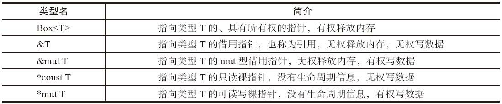
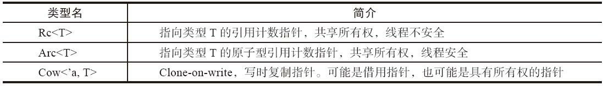
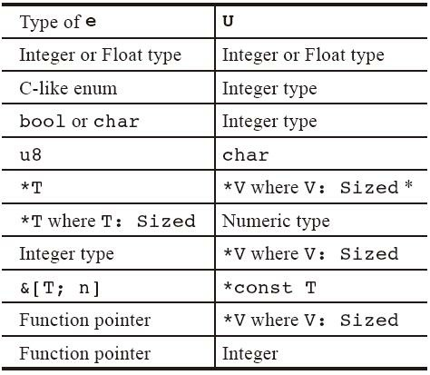
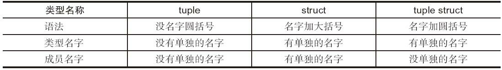

# rust学习

## hello world

```rust
fn main()
{
    println!("hello world !!")
}
```

运行程序

```shell
cargo run
```

rustup 换源

```shell
export RUSTUP_DIST_SERVER=https://mirrors.ustc.edu.cn/rust-static
export RUSTUP_UPDATE_ROOT=https://mirrors.ustc.edu.cn/rust-static/rustup
```

cargo 换源

$HOME/.cargo  下创建config文件

```shell
[source.crates-io]
registry = "https://github.com/rust-lang/crates.io-index"
replace-with = 'ustc'
[source.ustc]
registry = "git://mirrors.ustc.edu.cn/crates.io-index"
```


## 第一章 变量

### 变量声明

```rust
let variable: i32 = 100;
```

变量名: 变量类型 = 变量值   

变量类型可以省略, 如果可以从上下文中推到出变量类型.

```rust
fn main()
{
    let x = 5; // 不可变的
    x = 3; // 会报错
    
    let mut x = 5; // 变量可变了 (模式解构)
}
```

```rust
let mut x = 5; // mut x: i32
x = 10;
```

let 语句在此处引入了一个模式解构, 不能把let mut视为一个组合,而应该将mut x视为一个组合.  mut x是一个“模式”，我们还可以用这种方式同时声明多个变量： 

```rust
let (mut a, mut b) = (1, 2);
let Point { x: ref a, y: ref b} = p;
```

在Rust中，一般把 声明的局部变量并初始化的语句称为“变量绑定”，强调的是“绑定”的含 

义，与C/C++中的“赋值初始化”语句有所区别。


注意变量的声明和初始化可以是分开的, 只要在使用之前初始化了即可

```rust
fn test(confition: bool) {
    let x: i32; // 声明x, 不必使用mut修饰
    if condition {
        x = 1;  // 初始化x, 不需要x是mut的, 因为这是初始化,不是修改.
        println!("{}", x);
    }
    // 如果条件不满足,x 没有被初始化  但是没关系,只要这里不使用 x 就没事
}
```


### shadowing

可以使用相同的名字声明新的变量，新的变量就会shadow（隐藏）之前声明的同名变量，在后续的代码中这个变量名就是新变量。

````rust
fn main(){
    let spaces = "    ";
    let spaces = spaces.len();  // 可以改变变量的类型
}
````


### 类型推导

从上下文中的信息进行推导

```rust
fn main() {
    // 没有明确标出变量的类型, 但是通过字面量的后缀,编译器知道elem的类型为u8
    let elem = 5u8;
    
    // 创建一个动态数组, 数组内部包含的是什么元素类型可以不写
    let mut vec = Vec::new();
    vec.push(elem);
    // 后面调用了push函数,通过elem变量的类型, 编译器可以推导出vec的实际类型是 Vec<u8>
    
    println!("{:?}", vec);
    
}
```


### 类型别名

可以用type关键字给同一个类型起个别名（type alias）

```rust
type Age = u32;

fn grow(age: Age, year: u32) -> Age {
    age + year
}

fn main() {
    let x: Age = 20;
    println!("20 years later: {}", grow(x, 20));
}
```

类型别名还可以用在泛型场景

```rust
type Double<T> = (T, Vec<T>); // 小括号包围的是一个 tuple, 参考后面的复合类型
```


### 静态变量

rust中可以用static关键字声明静态变量

```rust
static GLOBAL: i32 = 0;
```

与let语句一样，static语句同样也是一个模式匹配。与let语句不同的 是，用static声明的变量的生命周期是整个程序，从启动到退出。static 变量的生命周期永远是'static，它占用的内存空间也不会在执行过程中回收。这也是Rust中唯一的声明全局变量的方法。

全局变量使用有很多限制

- 全局变量必须在声明的时候马上初始化； 
- 全局变量的初始化必须是编译期可确定的常量，不能包括执行期才能确定的表达式、语句和函数调用； 
- 带有mut修饰的全局变量，在使用的时候必须使用unsafe关键字

```rust
fn main() {
    // 局部变量声明, 可以留在后面初始化, 只要保证使用前已经初始化即可
    let x;
    let y = 1_i32;
    x = 2_i32;
    println!("{} {}", x, y);
    // 全局变量必须声明的时候初始化, 因为全局变量可以写到函数外面, 被任意一个函数使用
    static G1: i32 = 3;
    println!("{}", G1);
    
    // 可变全局变量 无论读写都必须用 unsafe修饰
    static mut G2: i32 = 4;
    unsafe {
        G2 = 5;
        println!("{}", G2);
    }
    //全局变量的内存不是分配在当前函数栈上,函数退出的时候,并不会销毁全局变量占用的内存空间,程序退出才会
}

```


### 常量

常量在绑定一个值后也是不可变的。与不可变的变量的区别是：

- 不能使用mut，常量永远不可变。
- 声明常量使用const关键字，类型必须被标注
- 常量可以在任何作用域内进行声明，包括全局作用域
- 常量只可以绑定到常量表达式，无法绑定到函数的调用结果或者只能在运行时才能计算出

```rust
const MAX_POINTS: u32 = 100_000;
```


### 数据类型

标量类型+复合类型

通常编译器可以推断出类型。但是复杂情况需要自己指定新类。

```rust
let guess:u32 = "42".parse().expect("Not a number");
```

标量类型

1. 整数类型
2. 浮点类型
3. 布尔类型
4. 字符类型


#### 布尔类型

布尔类型（bool）代表的是“是”和“否”的二值逻辑。它有两个值： true和false。一般用在逻辑表达式中，可以执行“与”“或”“非”等运算。

```rust
fn main() { 
    let x = true;
    let y: bool = !x; // 取反运算 
    
    let z = x && y; // 逻辑与,带短路功能 
    println!("{}", z); 
    
    let z = x || y; // 逻辑或,带短路功能 
    println!("{}", z); 
    
    let z = x & y; // 按位与,不带短路功能 
    println!("{}", z); 
    
    let z = x | y; // 按位或,不带短路功能 
    println!("{}", z); 
    
    let z = x ^ y; // 按位异或,不带短路功能 
    println!("{}", z); 
}
```


#### char类型

它可以描述任何一个符合unicode标准的字符值。在代码中，单个的字符字面量用单引号包围。 

```rust
fn main(){
    let x = 'z';
    let y: char = '￥';
    let z = '😀';
    let love = '❤'; // 可以直接嵌入任何 unicode 字符

}
```

因为char类型的设计目的是描述任意一个unicode字符，因此它占据的内存空间不是1个字节，而是4个字节。 

对于ASCII字符其实只需占用一个字节的空间，因此Rust提供了单字节字符字面量来表示ASCII字符。我们可以使用一个字母b在字符或者 字符串前面，代表这个字面量存储在u8类型数组中，这样占用空间比char型数组要小一些。

```rust
let x :u8 = 1;
let y :u8 = b'A';
let s :&[u8;5] = b"hello";
let r :&[u8;14] = br#"hello \n world"#;
```


#### 整数类型

各种整数类型之间的主要区分特征是: 有符号/无符号, 占据空间大小.

| 整数类型     | 有符号 | 无符号 |
| ------------ | ------ | ------ |
| 8 bits       | i8     | u8     |
| 16 bits      | i16    | u16    |
| 32 bits      | i32    | u32    |
| 64 bits      | i64    | u64    |
| 128 bits     | i128   | u128   |
| Pointer size | isize  | usize  |

Rust原生支持了从8位到128位的整数. 需要特别关注的是isize和usize类型. 它们占据的空间是不定的,  与指针占据的空间一致, 与所在的平台相关. 如果是32位系统上, 则是32位大小; 如果是64位系统上,  则是64位大小.

````rust
let var1 : i32 = 32; // 十进制表示 
let var2 : i32 = 0xFF; // 以0x开头代表十六进制表示 
let var3 : i32 = 0o55; // 以0o开头代表八进制表示 
let var4 : i32 = 0b1001; // 以0b开头代表二进制表示
````

在Rust中，我们可以为任何一个类型添加方法，整型也不例外。我们甚至可以不使用变量，直接对整型字面量调用函数： 

```rust
fn main() {
    println!("9 power 3 = {}", 9_i32.pow(3));
}
```

如果推断不出数据的类型,默认使用i32

整数溢出

默认情况下，在debug模式 下编译器会自动插入整数溢出检查，一旦发生溢出，则会引发panic；在 release模式下，不检查整数溢出，而是采用自动舍弃高位的方式。

如果编译一个优化后的版本，加上-O选项： 

```shell
rustc -O test.rs 
```

Rust编译器还提供了一个独立的编译开关供我们使用，通过这个开关，可以设置溢出时的处理策略

```shell
rustc -C overflow-checks=no test.rs
```

如果用户确实需要更精细地自主控制整数溢出的行为，可以调用标准库中的`checked_*`  `saturating_*`和`wrapping_*`系列函数

```rust
fn main() {
	let i = 100_i8;
	println!("checked {:?}", i.checked_add(i));
	println!("saturating {:?}", i.saturating_add(i));
	println!("wrapping {:?}", i.wrapping_add(i));
}
```

可以看到：`checked_*`系列函数返回的类型是`Option<_>`，当出现溢出的时候，返回值是None；`saturating_*`系列函数返回类型是整数，如果溢出，则给出该类型可表示范围的“最大/最小”值；`wrapping_*`系列函数 则是直接抛弃已经溢出的最高位，将剩下的部分返回.

为了 方便用户，标准库还提供了一个叫作`std::num::Wrapping<T>`的类型。它重载了基本的运算符，可以被当成普通整数使用。凡是被它包裹起来的整数，任何时候出现溢出都是截断行为。

```rust
use std::num::Wrapping;

fn main() {
    let big = Wrapping(std::u32::MAX);
    let sum = big + Wrapping(2_u32);
    println!("{}", sum.0);
}
```


#### 浮点类型

按占据空间大小区分，分别为f32和f64. 浮点类型的默认类型是 f64

表示形式有如下几种:

```rust
let f1 = 123.0f64;    // f64
let f2 = 0.1f64;      // f64
let f3 = 0.1f32;      // f32
let f4 = 12E+99_f64;  // f64 科学计数法
let f5 : f64 = 2;     // f64
```

浮点数的麻烦之处在于：它不仅可以表达正常的数值，还可以表达**不正常**的数值。 

在标准库中，有一个`std::num::FpCategory`枚举，表示了浮点数可能的状态：

```rust
enum FpCategory {
    Nan,
    Infinite,
    Zero,
    Subnormal,
    Normal,
}
```

 其中Zero表示0值、Normal表示正常状态的浮点数。

Subnormal状态是一种非常小的处在收敛的状态, 他是不准确的

Infinite和Nan是带来更多麻烦的特殊状态。Infinite代表的是“无穷大”，Nan代表的是“不是数字”(not a number). 

```rust
fn main() {
    let x = 1.0f32 / 0.0;
    let y = 0.0f32 / 0.0;
    println!("{} {}", x, y);
}
```

编译执行，打印出来的结果分别为inf NaN。**非**0数除以0值，得到的是inf，0除以0得到的是NaN。 

NaN这个特殊值有个特殊的麻烦，主要问题还在于它不具备“全序”的特点。

```rust
fn main() {
    let nan = std::f32::NAN;
    println!("{} {} {}", nan < nan, nan > nan, nan == nan);
}
// 结果是  false false false
```

也就是他的数值是不确定的,在任何时候都不确定.


#### 指针类型

rust对数据的组织操作有多种维度：

- 同一个类型， 某些时候可以指定它在栈上， 某些时候可以指定它在堆上。 内存分配方式可以取决于使用方式， 与类型本身无关。  
- 既可以直接访问数据， 也可以通过指针间接访问数据。 可以针对任何一个对象取得指向它的指针。 

- 既可以在复合数据类型中直接嵌入别的类型的实体， 也可以使用指针， 间接指向别的类型。  
- 甚至可能在复合数据类型末尾嵌入不定长数据构造出不定长的复合数据类型。 

rust中有多种指针类型



除此之外， 在标准库中还有一种封装起来的可以当作指针使用的类型， 叫“智能指针”（smart pointer）   



后面再具体介绍


### 类型转换

Rust对不同类型之间的转换控制得非常严格。必须显式的进行类型转换 以防止出现bug

```rust
fn main() {
    let var1: i8 = 41;
    let var2: i16 = var1 as i16;
    // 如果你写成let var2: i16 = var1; 那么就会报错
}
```

使用as进行强制的类型转换。并且只允许编译器认为合理的类型转换， 任意类型的转换也是不允许的，比如 将一个非数字字符转换为数字。有些时候， 甚至需要连续写多个as才能转成功， 比如&i32类型就不能直接转换为*mut i32类型， 必须像下面这样写才可以:

```rust
fn main() {
    let i = 42;
    let p = &i as *const i32 as *mut i32;
    println!("{:p}", p);
}
```

as表达式允许的类型转换如表所示。 对于表达式e as U， e是表达式， U是要转换的目标类型， 表中所示的类型转换是允许的。  



如果需要更复杂的类型转换， 一般是使用标准库的From Into等trait。


### 复合类型

#### tuple

创建tuple： 在小括号里，将值用逗号分开。tuple中的每一个位置都对应一个类型，tuple中各个元素类型可以不同。tuple是把几个类型组合到一起的最简单的方式。

```rust
let a: (i32, bool) = (1i32, false);
let b = ("a", (1i32, 2i32));
```

如果元组中只包含一个元素， 应该在后面添加一个逗号， 以区分括号表达式和元组：  

```rust
let a = (0,); // a是一个元组,它有一个元素
let b = (0); // b是一个括号表达式,它是i32类型
```


获取tuple中的值:  1.类似于python中的序列解包(模式匹配  pattern destructuring) 2. 直接获得指定位置的值，点表记法，后接元素的索引号。

````rust
fn main(){
    let some:(i32, f64, u8) = (50, 1.4, 3);
    
    let (x, y, z) = some;
    
    println!("{},{},{}", some.0, some.1, some.2);
}
````

元组内部也可以一个元素都没有。 这个类型单独有一个名字， 叫unit (单元类型):

```rust
let empty: () = ();
```

它占用0内存空间，这和空结构体一样。 使用`std::mem::size_of::<i8>()`可以计算空间大小

```rust
fn main() {
    println!("size of '()' {}", std::mem::size_of::<()>());
}
```


#### 数组

数组中的每个元素的类型必须是相同的。 数组的长度也是固定的，声明之后不能改变。数组是stack上分配的单个块 的内存。

```rust
fn main(){
    // 声明数组
    let a[i32; 5] = [1,2,3,4,5];  // a[i32; 5] [类型； 长度]
    
    let a = [3; 5]; // a == [3,3,3,3,3] 初始化的方法
    
    let first = a[0]; // 访问数组元素
}
```

如果访问的索引超出了数组的范围,那么  编译会通过并且不会报错, 运行时会报错!!!!!


#### struct

和元组类似，但是struct中的每个元素都可以有自己的名字

```rust
struct Point {
    x: i32,
    y: i32,
}
```

每个元素之间采用逗号分开， 最后一个逗号可以省略不写。   类型依旧跟在冒号后面， 但是不能使用自动类型推导功能， 必须显式指定。  

struct类型的初始化语法类似于json的语法， 使用“成员–冒号–值”的格式。  

  ```rust
  fn main() {
      let p = Point {x: 0, y: 0};
      println!("Point is at {} {}", p.x, p.y);
  }
  ```

struct有一种简化的写法，如果有局部变量的名字和成员变量的名字恰好一致， 那么可以省略重复的冒号初始化

```rust
struct Point{
    x: i32,
    y: i32
}

fn main() {
    // 刚好局部变量名字和结构体成员名字一致
    let x = 10;
    let y = 20;
    // 下面是简略写法， 等同于 由冒号的写法 Point {x:x, y:y}
    let p = Point {x, y};

    println!("Point is at {} {}", p.x, p.y);
}
```

获取结构体内部元素的方法， 1 加点的方式， 2 模式匹配

```rust
fn main() {
    let x = 10;
    let y = 20;
    let p = Point {x, y};

    let Point {x: px, y: py} = p;
    println!("Point is at {} {}",px, py);
    let Point {y, x} = p;  // 在模式匹配的时候 也可以使用简化写法, 会按照名字匹配
    println!("Point is at {} {}",x, y);
}
```

rust 允许使用一种简化 的语法赋值，使用另一个struct的部分成员。

```rust
struct Point3d {
    x: i32,
    y: i32,
    z: i32,
}

fn default() -> Point3d{
    Point3d {x: 0, y: 0, z: 0}
}

fn main() {
    // 使用default()函数初始化其他的元素 
    // ..expr 这样的语法， 只能放在初始化表达式中，所有成员的最后最多只能有一个
    let origin = Point3d {x: 5, ..default()};  // 赋值 给y，z
    let point = Point3d {z: 1, x: 2, ..origin};   // 赋值给z
}
```


#### tuple struct

rust 有一种数据类型叫 tuple struct， 他是tuple和struct的混合。 区别在于 tuple struct 有名字， 而他的成员没有名字。

```rust
struct Color(i32, i32, i32);
struct Point(i32, i32, i32);

// they are defined as follows
struct Color{
    0: i32,
    1: i32,
    2: i32,
}
```

虽然它们的内部结构是一样的，但是它们是完全不同的两个类型。   

tuple、 struct、 struct tuple  的区别



除了这些之外，他们没有区别了，整体对比

```rust
struct T1 {
    v: i32  // define struct
}

struct T2(i32);  // define tuple struct

fn main(){
    let v1 = T1 { v: 1 };
    let v2 = T2(1);          // init tuple struct
    let v3 = T2 { 0: 1 };    // init tuple struct
    
    let i1 = v1.v;
    let i2 = v2.0;
    let i3 = v3.0;
}
```

tuple struct有一个特别有用的场景， 那就是当它只包含一个元素的时候， 就是所谓的newtype idiom。  让我们非常方便地在一个类型的基础上创建了一个新的类型。  

```rust
fn main() {
    struct 	Inches(i32);
    
    fn f1(value: Inches) {}
    fn f2(value: i32) {}
    
    let v : i32 = 0;
    f1(v);  // 编译不通过,'mismatched types'
    f2(v);
}
```

编译不通过是因为`Inches` 和 `i32`是不同的类型，函数调用参数不匹配。

```rust
fn type_alias() {
    type I = i32;  // 当换成别名的时候就通过了
    
    fn f1(v : I) {}
    fn f2(v : i32) {}
    
    let v : i32 = 0;
    f1(v);
    f2(v);
}
```

这是因为通过type创建的只是一个新的**类型名称**，但这个类型**不是**全新的类型，而只是一个具体类型的**别名**。在编译器看来， 这个别名与原先的具体类型是一模一样的。 而使用`tuple struct`做包装， 则是创造了一个**全新的类型**， 它跟被包装的类型不能发生隐式类型转换， 可以具有不同的方法， 满足不同的trait， 完全按需而定。  


#### enum

枚举在rust中代表了`或`的类型关系。

rust中的enum要强大很多， 它可以为每个成员指定附属的类型信息。

Rust的enum中的每个元素的定义语法与struct的定义语法类似。 可以像空结构体一样， 不指定它的类型； 也可以像tuple struct一样， 用圆括号加无名成员； 还可以像正常结构体一样， 用大括号加带名字的成员。

```rust
enum Number {
    Int(i32),
    Float(f32),
}
```

使用match语句读取enum内部数据的示例

```rust
enum Number {
    Int(i32),
    Float(i32),
}

fn read_num(num: &Number) {
    match num {
        // 如果匹配到了 Number::Int， value就是i32
        &Number::Int(value) => println!("Integer {}", value),
        // 如果匹配到了 Number::Float， value就是f32
        &Number::Float(value) => println!("Float {}", value),
    }
}

fn main() {
    let n: Number = Number::Int(10);
    read_num(&n);
}

```

neum需要记住当前存贮的值的类型，在C语言中需要程序员自己记录，在rust 中则是编译器帮助你处理。所以我们不需要自己处理值的类型。

我们查看类型的大小，可以看到 Number的类型是i32和f32中size最大的。`max（sizeof（i32）, sizeof（f32） ） =  max（4 byte， 4 byte） = 4 byte `  

而它总共占用的内存是8 byte， 多出来的4 byte就是用于保存类型标记的。 之所以用4 byte， 是为了内存对齐。  

```rust
fn main() {
    println!("Size of Number: {}", std::mem::size_of::<Number>());
    println!("Size of i32:    {}", std::mem::size_of::<i32>());
    println!("Size of f32:    {}", std::mem::size_of::<f32>());
}
```

Rust标准库中有一个极其常用的enum类型`Option<T>`， 它的定义如下 :

```rust
enum Option<T> {
    None,
    Some(T),
}
```

由于它实在是太常用， 标准库将Option以及它的成员Some、 None都加入到了Prelude中， 用户甚至不需要use语句声明就可以直接使用。它表示的含义是“要么存在、 要么不存在”。 比如 `Option<i32>`表达的意思就是“可以是一个i32类型的值， 或者没有任何值”。  


## 第二章 语句和表达式

表达式（Expression）语句（Statement）

语句和表达式的区分方式是后面带不带分号`;` 。 如果**带了分号**， 意味着这是一条**语句**，它的类型是（） ； 如果**不带分号**， 它的类型就是**表达式**的类型。

|        |          |          |
| ------ | -------- | -------- |
| 表达式 | 不带分号 | 产生值   |
| 语句   | 带分号   | 不产生值 |


### 语句 

一个Rust程序， 是从main函数开始执行的。 而函数体内， 则是由一条条语句组成的。  

表达式可以是语句的一部分， 反过来， 语句也可以是表达式的一部分。 一个**表达式**总是会**产生**一个**值**， 因此它必然有类型； 语句不产生值， 它的类型永远是（） 。 **如果把一个表达式加上分号， 那么它就变成了一个语句**； 如果把语句放到一个**语句块**中包起来， 那么它就可以被当成一个表达式使用。


### 表达式

每种表达式都可以嵌入到另外一种表达式中， 组成更强大的表达式。

Rust的表达式包括`字面量表达式`、 `方法调用表达式`、 `数组表达式`、`索引表达式`、 `单目运算符表达式`、 `双目运算符表达式`等。

Rust表达式又可以分为**左值**（lvalue） 和**右值**（rvalue） 两类。   左值接收值，右值产生值。

|            |                 |                                                   |
| ---------- | --------------- | ------------------------------------------------- |
| 算术运算符 | + - * / %       |                                                   |
| 比较运算符 | == != < > <= >= | 不支持连续比较a==b==c                             |
| 位运算符   | ! & \| ^ << >>  |                                                   |
| 逻辑运算符 | && \|\| !       | 支持短路运算                                      |
| 赋值运算符 | =               | Rust规定， 赋值表达式的类型为unit， 即空的tuple() |
|            |                 |                                                   |

不支持 ++  -- 运算符 使用 +=1 -=1代替


### 语句块表达式

```rust
// 语句块可以是表达式,注意后面有分号结尾,x的类型是()
let x : () = { println!("Hello."); };
// Rust将按顺序执行语句块内的语句,并将最后一个表达式类型返回,y的类型是 i32
let y : i32 = { println!("Hello."); 5 };

// 利用这样的特性来写返回值
fn my_func() -> i32 {
    // 各种语句
    100  // 返回100
}
```


### if else

```rust
if xxx {}
else if xxx {}
else {}
```

`if` 后续的结果语句块要求一定要用大括号包起来， 不能省略， 以便明确指出该if语句块的作用范围。 这个规定是为了避免“悬空else”导致的bug。   

- if表达式的条件必须是bool类型的。不能是一个可以判定为真的值
- if表达式中，与条件相关联的代码块叫做分支（arm）
- 可选择在后面加上else表达式

if 也是一个表达式

```rust
fn main()
{
    let condition = true;
    let number = if condition { 5 } else { 6 }; // 注意这两个块中的数字，可以被返回
    println!("the value of number is: {}", number);
}
```

但是这种需要注意的是两个分支的表达式返回的类型必须一致，否则就会造成编译错误。如果else分支省略掉了， 那么编译器会认为else分支的类型默认为()。


### loop

使用loop表示一个无限死循环。  类似于while  true

我们可以使用continue和break控制执行流程。 continue； 语句表示本次循环内， 后面的语句不再执行， 直接进入下一轮循环。break； 语句表示跳出循环， 不再继续。  

另外， break语句和continue语句还可以在**多重循环**中选择跳出到哪一层的循环。  

```rust
fn main() {
    // A counter variable
    let mut m = 1;
    let n = 1;
    
    'a: loop {
        if m < 100 {
            m += 1;
        } else {
            'b: loop {
                if m + n > 50 {
                    println!("break");
                    break 'a;
                } else {
                    continue 'a;
                }
            }
        }
    }
}

```

我们可以在loop while for循环前面加上“**生命周期标识符**”。 该标识符以单引号开头， 在内部的循环中可以使用break语句选择跳出到哪一层。  

与if结构一样， loop结构也可以作为表达式的一部分。  

在loop内部break的后面可以跟一个表达式， 这个表达式就是最终的loop表达式的值。 如果一个loop永远不返回， 那么它的类型就是“发散类型”。   

```rust
fn main() {
    let v = loop {
        break 10;
    };
    println!("{}", v);
}

fn main() {
    let v = loop {};
    println!("{}", v);
}
```


### while

while语句是带条件判断的循环语句。 其语法是while关键字后跟条件判断语句， 最后是结果语句块。  

```rust
fn main() {
    let mut n = 1;

    while n < 101 {
        if n % 15 == 0 {
            println!("fizzbuzz");
        } else if n % 3 == 0 {
            println!("fizz");
        } else if n % 5 == 0 {
            println!("buzz");
        } else {
            println!("{}", n);
        }
        n += 1;
    }
}
```

while语句中也可以使用continue和break来控制循环流程。  

loop{}和while true{}循环有什么区别?

loop和while true语句在运行时没有什么区别， 它们主要是会影响编译器内部的静态分析结果。  

```rust
let x;
loop { x = 1; break; }
println!("{}", x)
// 以上语句在Rust中完全合理。 因为编译器可以通过流程分析推理出x=1； 必然在println！ 之前执行过， 因此打印变量x的值是完全合理的。

let x;
while true { x= 1; break; }
println!("{}", x);
// 上面的语句会有错误， while语句的执行跟条件表达式在运行阶段的值有关， 因此它不确定x是否一定会初始化， 于是它决定给出一个错误：use of possibly uninitialized variable， 也就是说变量x可能没有初始化。

```


### for循环

rust的for循环不是 C的那种三段式的，而是像python那样的for循环。

for循环的主要用处是利用迭代器对包含同样类型的多个元素的容器执行遍历， 如数组、 链表、 HashMap、 HashSet等。   

```rust
fn main () {
    let array = &[1,2,3,4,5];
    
    for i in array {
        println!("The number is {}", i);
    }
}
```


## 第三章 函数

声明函数使用`fn`关键字.函数可以有一系列的输入参数， 还有一个返回类型.

```rust
fn main()
{ }
```

Rust编写的可执行程序的入口就是fn main()函数。  

```rust
fn add1(t: (i32: i32)) -> i32 {
    t.0 + t.1
}

fn add2((x,y) : (i32,i32)) -> i32 {
	x + y
}
```

函数的输入是一个tuple(i32, i32) 返回的是 i32值. 函数体内部是一个表达式, 这个表达式的值就是函数的返回值. 函数也可以不写返回类型,这时返回类型是unit(). 

在Rust中， **每一个函数**都具有自己单独的类型， 但是这个类型可以自动转换到**fn类型**。 示例如下：  

```rust
fn main () {
    // 先让func 指向 add1
    let mut func = add1;
    // 再重新赋值, 让func指向 add2
    func = add2;  // 这里会报错,因为两个函数的类型不符
}
```

虽然add1和add2有同样的参数类型和同样的返回值类型， 但它们是不同类型， 所以这里报错了。 修复方案是让func的类型为通用的fn类型即可：  

```rust
// 写法一,用 as 类型转换
let mut func = add1 as fn((i32,i32))->i32;
// 写法二,用显式类型标记
let mut func : fn((i32,i32))->i32 = add1;
```

嵌套定义   Rust的函数体内也允许定义其他item， 包括静态变量、 常量、 函数、 trait、 类型、 模块等。 比如: 

```rust
fn test_inner() {
	static INNER_STATIC: i64 = 42;
    
	// 函数内部定义的函数
	fn internal_incr(x: i64) -> i64 {
		x + 1
	} 
    
    struct InnerTemp(i64);
    impl InnerTemp {
		fn incr(&mut self) {
			self.0 = internal_incr(self.0);
		}
	} 
    
    // 函数体,执行语句
	let mut t = InnerTemp(INNER_STATIC);
	t.incr();
	println!("{}", t.0);
}
```

函数体中的语句和表达式

1. 函数体由一系列语句组成，可选的由一个表达式结束。
2. rust是一个基于表达式的语言。
3. 语句是执行一些动作的指令。
4. 表达式会计算产生一个值。

```rust
fn main(){
    let x = 5; // 语句，他没有一个返回值。
    let y = 6+7; // 6+7 是一个表达式，他会产生一个返回值
    
    let y = {
        let x = 1;
        x + 3
    }; // 这个块，也是一个表达式，其中x+3的值会作为返回值。
    
    let y = {
        let x = 1;
        x + 3； // 当有x+3; 这个块就不会有返回值了，返回的是一个空的tuple，
    }; 
}
```

函数的参数

pararmeters  函数定义时的那个参数,

arguments  函数调用时传进去的参数

函数定义时 参数的类型必须指定.


函数的返回值

- 在`->`符号后面声明函数返回值的类型，但是不可以为返回值命名。
- rust中，默认返回值是函数体中最后一个表达式的值。
- 如果要提前返回值，需要用return关键字，指定一个值。

```rust
fn five() -> i32
{
    5 // 没有分号，采用默认的返回形式
}

fn main(){
    let x = five();
}
```


### 发散函数

Rust支持一种特殊的发散函数（Diverging functions） ， 它的返回类型是感叹号`!` 。 如果一个函数根本就不能正常返回， 那么它可以这样写：  

```rust
fn diverges() -> ! {
    panic!("This function never returns!");
}
```

发散类型的最大特点就是， 它可以被转换为任意一个类型. 为什么需要返回这样的类型呢?

```rust
let p = if x { 
    panic!("error");
} else {
    100
};
```

if else 中要求类型相同,  那么 panic!  就应该返回和100 相同的类型,这就是 `!`类型的作用了. 

在Rust中， 有以下这些情况永远不会返回， 它们的类型就是！ 。

- panic！ 以及基于它实现的各种函数/宏， 比如unimplemented！ 、unreachable!
- 死循环loop{}；
- 进程退出函数std::process::exit  以及类似的libc中的exec一类函数。  


### main函数

在大部分主流操作系统上， 一个进程开始执行的时候可以接受一系列的参数， 退出的时候也可以返回一个错误码。   

Rust的设计稍微有点不一样， 传递参数和返回状态码都由单独的API来完成.

```rust
fn main () {
    for arg in std::env:args() {
        println!("Arg: {}", arg);
    }
    std::process::exit(0);  // 指定错误码
}

// 执行 test -opt1 opt2 -- opt3
```

读取环境变量， 可以用`std::env::var()` 以及`std::env::vars()`函数获得。   

```rust
fn main() {
    for arg in std::env::args() {
        match std::env:var(&arg) {
            Ok(val) => println!("{}: {:?}", &arg, val),
            Err(e) => println!("couldn't find environment {}, {}", &arg, e),
        }
    }
    println!("All environment varible count {}", std::env::vars().count());
}
```

var() 函数可以接受一个字符串类型参数， 用于查找当前环境变量中是否存在这个名字的环境变量， vars() 函数不携带参数， 可以返回所有的环境变量。  

此前， Rust的main函数只支持无参数、 无返回值类型的声明方式，即main函数的签名固定为： fn main()  -> () 。  

Rust设计组扩展了main函数的签名，使它变成了一个泛型函数， 这个函数的返回类型可以是任何一个满足Terminationtrait约束的类型， 其中（ ） 、 bool、 Result都是满足这个约束的， 它们都可以作为main函数的返回类型。   


### const  fn

函数可以用const关键字修饰， 这样的函数可以在编译阶段被编译器执行， 返回值也被视为编译期常量。  

cube函数接受数字参数， 它会返回一个数字， 而且这个返回值本身可以用于给一个const常量做初始化， const常量又可以当成一个常量数组的长度使用。  

```rust
#![feature(const_fn)]

const fn cube(num:usize) -> usize {
    num * num * num
}

fn main() {
    const DIM: usize = cube(2);
    const ARR: [i32; DIM] = [0; DIM];
    
    println!("{:?}", ARR);
}
```


## 第四章 trait

### 成员方法

trait中可以定义函数。   

```rust
trait Shape {
    fn area(&self) -> f64;
}
```

所有的trait中都有一个隐藏的类型Self（大写S） ， 代表当前这个实现了此trait的具体类型。 trait中定义的函数， 也可以称作关联函数(associated function).

如果函数的第一参数是 `self`, 这个参数可以称为 `receiver(接收者)`, **有receiver的称为 方法(method), 可以通过变量实例通过小数点调用(和python中的语法类似). 没有receiver的称为静态函数, 可以通过`::`双冒号调用**. 两者没有本质区别.


## 第五章 rust中的所有权

### 什么是所有权？

在其他的语言中，都需要在运行时对计算机的内存进行管理。

有些语言有垃圾回收机制来处理不再使用的内存。

有些语言，需要显式的分配和释放内存。


rust采用另一种方式来管理内存：所有权。内存管理的工作是在编译时完成的。


### stack vs heap

- stack 先进后出
- heap 先进先出

所有存储在Stack上的数据必须拥有已知的固定的大小...编译时大小未知的数据 或运行时大小可能发生变化的数据必须存放在heap上.....

当把 数据放入heap时, 会需要请求一定数量的空间.. 这是操作系统控制的,在heap上找到一个足够大的空间,把他标记为在用, 然后返回一个指针, 就是空间的地址.

当代码调用函数时, 值被传入到函数(也包括指向heap的指针),,,函数本地的变量被压到stack上, 当函数结束后, 这些值会从stack上弹出.

所有权解决的问题:

- 跟踪代码的哪些部分正在使用heap的哪些数据
- 最小化heap上的重复数据量
- 清理heap上未使用的数据以避免空间不足

一旦你懂得所有权, 那么就不需要经常去想stack或heap了.. 但是知道管理heap数据是所有权存在的原因, 这有助于解释它为什么会这样工作.


### 所有权规则：

- 每个值都有一个变量，这个变量是该值的所有者
- 每个值同时只能有一个所有者
- 当所有者超出作用域（scope）时，该值将被删除。

作用域

```rust
fn main(){
    // s is not available
    let s = 6; // s is available
    // you can start operating the s
}// overflow the scope of s， s is disabled
```


### 以字符串为例子，讲解所有权的概念

字符串类型有两种形式：

1. 字符串字面值：程序里手写的那些字符串值。他们是不可变的。这些值是直接写在程序代码里的，存储在栈内存上。
2. String：在heap上分配的存储空间，能够存储在编译时未知数量的文本。

创建string类型的值

可以使用from函数从字符串字面值创建出string类型。`let s = String::from("hello");`

````rust
fn main(){
    let mut s = String::from("hello");
    s.push_str(",World");  // modify string
    println!("{}", s);
} // 超出作用域范围，会将s的内存释放
````

对于某个值来说，当拥有它的变量超出他的作用域范围时，内存会立即自动的交还给操作系统。

从上面所有权的规则和变量的作用域两个方面来讲，当我们将一个变量赋值给另一个变量时，数据的所有权就发生了变更，而当这两个变量超出了作用域的范围后，都应当被销毁。而此时就存在问题了，因为两个变量的实际存储的是相同的值，会不会将相同的内存释放两次。看如下的例子

```rust
fn main(){
    let x = 5;
    let y = x;  // 按照规则，5的所有权交给了y
    println!("{} {}", x, y); // 如果按照之前的逻辑，x，y都需要释放。
}
```

针对变量和数据（如5）之间的交互，rust设计了一个**移动（move）**的概念。

在这里是将数据的所有权交给了y，可以认为是一种浅拷贝，只是拷贝了数据的引用。不过如5或者字符串字面值这种简单直接的数据类型，浅拷贝和深拷贝的区别不大，因为这些数据本身就在数据栈中，只是重新加入了一遍。

如果是复杂的数据类型，比如String类型和数组类型等，他们的数据是放在堆内存中的，栈中只存放了数据的引用。他们的所有权移动（move）是另一种形式了。

以字符串String类型举例：

```rust
let s1 = String::from("hello");
let s2 = s1;
```

一个 String 类型由3部分组成

| name                                                         | value      |
| ------------------------------------------------------------ | ---------- |
| ptr（指向存放字符串内容的内存指针）                          | 指向堆内存 |
| 拷贝len （一个长度，存放字符串内容所需的字节数）             | 5          |
| capacity（一个容量，string从操作系统总共获得内存的总字节数） | 5          |

这一部分存放于栈内存中。

堆内存拷贝

| index | value |
| ----- | ----- |
| 0     | h     |
| 1     | e     |
| 2     | l     |
| 3     | l     |
| 4     | o     |

在rust中当s2 = s1时，并没有复制堆内存中的东西，而只是复制了引用，同时rust使**s1的引用失效**。所以在超出作用域释放内存时，就不用再释放s1了。

同时如果在之后的代码中使用失效的s1变量，是会导致错误的。

```rust
fn main(){
	let s1 = String::from("hello");
	let s2 = s1;
    println!("{} {}", s1, s2); // Error: borrow of moved value: 's1'
}
```

这里隐含的一个设计原则是：rust不会自动创建数据的深拷贝，都是默认建立的浅拷贝。

当我们需要深拷贝的时候，需要调用克隆（clone）这个方法

```rust
fn main(){
    let x = 5;
    let y = x.clone(); // 深拷贝
    println!("{} {}", x, y);
}
```


于此对应，在栈上的数据的拷贝叫 复制。并有一个叫`Copy trait`的方法。

- `Copy trait`, 可以用于像整数这样完全存放在stack上面的类型
- 如果一个类型实现了copy这个trait，那么旧的变量在赋值后仍然可用
- 如果一个类型或者该类型的一部分实现了`Drop trait`，那么rust不允许他再实现`Copy trait`

一些拥有Copy trait 的类型

- 任何简单标量的组合类型都可以是copy的
- 任何需要分配内存或某种资源的都不是copy的
- 一些拥有copy trait的类型
  - 所有的整数类型
  - bool
  - char
  - 所有浮点类型
  - tuple类型，如果tuple中所有的字段都是可以copy的，否则不行。


### 所有权和函数

将值传递给函数和将值传递给变量，产生的效果是相似的。传递给函数只会发生两种情况：移动或者复制。

```rust
fn main(){
    let s = String::from("Hello World");
    take_ownership(s); // 将s的所有权转向函数内部了, 在外部就不能访问了
    let x = 5;
    makes_copy(x);  // 由于类型的原因，x在外面还是可以访问的
    println!("x: {}", x);
}

fn take_ownership(some_string: String)
{
    println!("{}", some_string)
}

fn makes_copy(some_number: i32)
{
    println!("{}", some_number);
}

```

返回值和作用域和所有权

函数在返回值的过程中，同样也会发生所有权的转移

一个变量的所有权总是遵循同样的模式：

- 把一个值赋给其他变量时就会发生移动
- 当一个包含heap数据的变量离开作用域时，它的值就会被drop函数清理，除非数据的所有权转移到另一个变量上。

```rust
fn main(){
    let s1 = gives_ownership();
    let s2 = String::from("hello");
    let s3 = takes_and_gives_back(s2);
    // 这里s2不再可用
}// s1 s2 s3 都被销毁

fn gives_ownership()->String{
    let some_string = String::from("hello");
    some_string  // some_string 的所有权返回到main函数了
}

fn takes_and_gives_back(a_string: String)->String{
    a_string  // s2 的所有权传递进来，然后又被传递出去。
}
```

如何让函数使用某个值，但不获得其所有权？

使用 引用或者借用。什么是引用，将参数的类型变为 &String 而不是String

&符号就表示引用：允许你引用某些值而不取得其所有权

````rust
fn main(){
    let s1 = String::from("Hello");
    let len = calculate_length(&s1);
    
    println!("the length of '{}' is {}", s1, len);
}

fn calculate_length(s: &String)->usize{
    s.len() // 超出作用域 但并不清理存储空间，因为并未获得所有权
}
````

是否能够修改借用？ 不行的，和变量一样，默认都是不可以修改的。除非我们将他设置为可变的mut。

````rust
fn main(){
    let mut s1 = String::from("Hello");
    let len = calculate_length(&mut s1);
    
    println!("the length of '{}' is {}", s1, len);
}

fn calculate_length(s: &mut String)->usize{
    s.push_str(", world");
    s.len() // 超出作用域 但并不清理存储空间，因为并未获得所有权
}
````

可变引用的重要限制是：在特定的作用域内，对某一块数据，只能有一个可变的引用。这样做的好处是可在编译时防止数据竞争。

以下三种行为下会发生数据竞争：

- 两个或多个指针同时访问同一个数据。
- 至少有一个指针用于写入数据
- 没有使用任何机制来同步对数据的访问


可以通过创建新的作用域，来允许非同时的创建多个可变引用

````rust
fn main(){
    let mut s = String::from("Hello");
    {
        let s1 = &mut s;
    }
    let s2 = &mut s; // 虽然有两个可变引用，但是他们的作用域不重叠
}
````

另一个限制：不可以同时拥有一个可变和一个不可变的引用(同一个变量)。多个不可变引用是可以的。

引用有引发悬空指针的问题

```rust
fn main(){
    let r = dangle();
}

fn dangle() -> &String{
    let s = String::from("hello");
    &s  // 返回引用，但是s在函数结束的时候就要被销毁了，这个引用也会失效。  这里会引入一个生命周期的概念，之后会讲
}
```


### 字符串切片

字符串切片是指字符串中一部分内容的引用。

形式： [开始索引..结束索引]

- 开始索引就是切片起始位置的索引值
- 结束索引是切片终止位置的下一个索引值

```rust
fn main(){
    let s = String::from("Hello world");
    
    let hello = &s[0..5];
    let world = &s[6..11];
    println!("{}, {}", hello, world);
}
```

字符串字面值就是一个切片，字符串字面值被直接存储在二进制程序中。

```rust
fn main(){
    let s = "Hello world";  // s是&str 字符串切片类型的
    println!("{}", s);
}
```

将字符串切片作为参数传递

````rust
fn first_word(s: &String) -> &str{}
// 改为
fn first_word(s: &str) -> &str{}
````

使用方法 ：1. 使用字符串切片直接调用该函数。2. 使用String，可以创建一个完整的String切片来调用该函数。

定义函数时使用字符串切片来代替字符串会使我们的api更加通用，且不会损失任何功能。

````rust
fn main() {
    let my_string = String::from("Hello world");
    let wordIndex = first_world(&my_string[..]);  // 这里的..
    
    let my_string_literal = "hello_world";  // 本身就是字符串切片类型
    let wordIndex = first_world(my_string_literal);
}

fn first_world(s: &str) -> &str{ // 采用字符串切片
    let bytes = s.as_bytes();
    for(i, &item) in bytes.iter().enumerate()
    {
        if item == b' '
        {
            return &s[..];
        }
    }
    &s[..]
}

````


##  第六章 `rust`中的`struct`

什么是struct？ 结构体，自定义的数据类型，为相关联的值命名，打包=>有意义的组合

### 定义struct

```rust
struct User{  // 使用struct关键字
    username: String, // 字段名称和类型
    email: String, 
    sign_in_count: u64,
    active: bool, // 最后的字段也要有逗号
}
```

### 实例化struct

想要使用必须先实例化。

- 为每个字段指定具体的值
- 无需按声明顺序进行指定

```rust
struct User{
    username: String,
    email: String,
    sign_in_count: u64,
    active: bool,
}

fn main(){
    let user1 = User{
        email: String::from("abc@123.com"),
        username: String::from("Nikky"),
        active: true,
        sign_in_count: 556,  // 初始化时要给每个成员都赋值
    };
}
```

### 获取struct里面的某个值

使用点 标记法

```rust
let mut user1 = User{  // 如果使用mut标记，标记struct是可变的，那么整个struct的字段都是可变的
        email: String::from("abc@123.com"),
        usernameL: String::from("Nikky"),
        active: true,
        sign_in_count: 556,
};
user1.email = String::from("anotheremail@123.com");
```


### struct作为函数返回值

将struct作为函数最后的表达式，就可以将struct作为函数的返回值使用。

### 初始化字段的简写

当字段名与字段值对应的变量名相同时，就可以使用字段初始化简写的方式：

```rust
struct User{
    username: String,
    email: String,
    sign_in_count: u64,
    active: bool,
}

fn build_user(email: String, username: String)->User{
    User {
        email, // 使用了简写的方式
        username,  // 使用了简写的方式
        active: true,
        sign_in_count: 0,
    }
}
```

### struct 中的更新语法

当想要基于一个struct实例创建一个新实例的时候，可以使用struct更新语法：

````rust
let user2 = User{
    email: String::from("anotheremail@123.com")
    username: String::from("anothername"),
    active: user1.active,  // 如果不使用更新的语法，需要从之前的struct指定值
    sign_in_count: user1.sign_in_count,
};

let user2 = User{
    email: String::from("anotheremail@123.com")
    username: String::from("anothername"),
    ..user1  // struct更新语法，使用两个..。剩下的值使用user1的值
};
````

### tuple struct

定义类似tuple的struct。需求：

1. tuple struct整体有个名字，但里面的元素没有名字
2. 适用范围：想给整个tuple起名，并让它不同于其他tuple，而且又不需要给每个元素起名。

定义tuple struct： struct + 名称(元素类型)

````rust
struct Color(i32, i32, i32);
struct Point(i32, i32, i32);
let black = Color(0,0,0);
let origin = Point(0,0,0);
````


### 没有任何字段的struct (unit-Like Struct)

可以定义没有任何字段的struct，叫做unit-like struct

适用于需要在某个类型上实现某个trait，但是在里面又没有想要存储的数据。

### struct数据的所有权

````rust
struct User{
    username: String,
    email: String,
    sign_in_count: u64,
    active: bool,
}
````

上述结构体的字段使用了String而不是&str，并且u64等基础类型

- 所以该struct实例拥有其所有的数据的所有权
- 只要struct的实例是有效的，那么里面的字段数据也是有效的。

struct里面也可以存放引用，但这需要使用生命周期（以后再讲）

- 生命周期保证只要struct实例是有效的，那么里面的引用也是有效的
- 如果struct里面存储引用，而不使用生命周期，就会报错。

### 使用struct的例子

假如要计算一个矩形的面积，我们需要长宽进行计算，也就是我们需要两个参数。

```rust
fn main()
{
    let w = 30;
    let l = 50;
    prinfln!("{}", area(w, l));
}

fn area(wigth: u32, length: u32) -> u32{
    wigth * length
}
```

上面的例子的问题是矩形的长宽是独立的，没有将他们联系起来，也就是不统一。

使用元组可以将两个参数组合起来，但是它的问题的是哪个是长，哪个是宽，容易混淆

````rust
fn main()
{
    let rect = (30, 50);

    println!("{}", area(rect));
}

fn area(dim: (u32, u32)) ->u32
{
    dim.0 * dim.1
}
````

使用struct对每个参数起名字

```rust
struct Rectangle
{
    width: u32,
    length: u32,
} // 使用结构体来保存长宽的数据

fn main()
{
    let rect = Rectangle{
        width: 30,
        length: 50,
    };
    println!("{}", area(&rect));  // 保留了所有权
    println!("{}", rect); // 这里打印会报错
}

fn area(rect: &Rectangle) ->u32
{
    rect.width * rect.length
}

```

### struct的调试模式

如上面例子所示

````rust
println!("{}", rect);
````

这里直接打印一个struct是不行的，因为这个struct并没有实现`std::fmt::Display`这个接口，类似于python中没有实现`__str__`这个方法，无法打印出struct中具体的数据。

修改提示可以使用`{:?}`进行格式化

```rust
println!("{:?}", rect);
println!("{:#?}", rect);
```

但是这样也会报错，因为没有开启struct的debug模式，我们需要显示的开启这个功能

```rust
#[derive(Debug)]
struct Rectangle
{
    width: u32,
    length: u32,
} 
```

其中derive是一种派生，这是实现一种trait的方式。

### struct的方法

方法和函数类似：`fn`关键字、名称、参数、返回值相似

不同之处：

- 方法是在struct（或者`enum`、`trait`对象）的上下文中定义
- 第一个参数是self，表示方法被调用的struct实例

方法的定义

- 使用`impl`关键字，定义在`impl`块中，
- 方法的第一个参数可以是&self，也可以获得其所有权或可变借用，和其他参数一样。

```rust
#[derive(Debug)]
struct Rectangle
{
    width: u32,
    length: u32,
}

impl Rectangle{
    fn area(&self) ->u32
    {
        self.width * self.length
    }
}

fn main()
{
    let rect = Rectangle{
        width: 30,
        length: 50,
    };

    println!("{}", rect.area());
    println!("{:#?}", rect);
}
```

#### 方法调用的运算符

rust没有->运算符

rust会自动解引用或者自动引用：在调用方法时就会发生这种行为

在调用方法时，rust根据情况自动添加`& &mut *`，以便object可以匹配方法的签名。

下面两行代码效果相同：

-  p1.distance(&p2);
- (&p1).distance(&p2);

```rust
impl Rectangle{
    fn area(&self) ->u32
    {
        self.width * self.length
    }
    
    fn can_hold(&self, other: &Rectangle)->bool{
        self.width > other.width && self.length > other.length
    }
}
```

如上我们添加一个方法之后。试着调用函数

```rust
fn main()
{
    let rect1 = Rectangle{
        width: 30,
        length: 50,
    };
    
    let rect2 = Rectangle{
        width: 20,
        length: 10,
    };

    println!("{}", rect1.can_hold(&rect2));
}
```

#### 关联函数

可以在`impl`块里定义不把self作为第一个参数的函数，他们叫关联函数例如 String::from()

关联函数通常用于构造器，用来生成关联类型的实例。

```rust
impl Rectangle{
    fn area(&self) ->u32
    {
        self.width * self.length
    }
    
    fn can_hold(&self, other: &Rectangle)->bool{
        self.width > other.width && self.length > other.length
    }
    
    fn square(size: u32) -> Rectangle{
        Rectangle {
            width: size,
            length: size,
        }
    }
}

fn main(){
    let s = Rectangle::square(20);
}
```

**每个`struct`可以有多个`impl`块**

------

## 第七章 枚举与模式匹配

### 定义枚举

以ip地址作为例子，举例

```rust
enum IpAddrKind {
    V4,
    V6, // 枚举的变体
}

let four = IpAddrKind::V4; // 创建枚举值， 但是 里面没有具体的参数值阿？
let six = IpAddrKind::V6;
```

将枚举作为参数传递

```rust
enum IpAddrKind {
    V4,
    V6,
}

fn route(ip_kind: IpAddrKind){}

fn main(){
    let four = IpAddrKind::V4;
    let six = IpAddrKind::V6;

    route(four);
    route(six);
    route(IpAddrKind::V6);
}
```

枚举作为struct中的一个成员使用。

```rust
enum IpAddrKind {
    V4,
    V6,
}
struct IpAddr {
    kind: IpAddrKind,
    address: String,
}
fn main() {
    let home = IpAddr{
        kind: IpAddrKind::V4, // 这里还是没有具体的值
        address: String::from("127.0.0.1"),
    };
    let loopback = IpAddr{
        kind: IpAddrKind::V6,
        address: String::from("::1"),
    };
}
```

将数据附加到枚举变体中

```rust
enum IpAddr {
    V4(u8,u8,u8,u8),  // 在变体中指定就可以向其中存储数据
    V6(String),
}
 
fn main() {
    let home = IpAddrKind::V4(127,0,0,1);
    let loopback = IpAddrKind::V6(String::from("::1"));
}
```

优点： 

- 不需要额外使用struct结构
- 每个变体可以拥有不同的类型以及关联的数据量

### 为枚举定义方法

与`struct`相似，枚举的方法也是定义在`impl`中

```rust
impl Message {
    fn call(&self) {}
}
```

### Option枚举类型

Option定义于标准库中。在prelude预导入模块中。

他描述了：某个值可能存在（某种类型）或者不存在的情况。为了替换NULL这个值。

RUST 中是没有NULL的。当你尝试使用非NULL值那样使用NULL值的时候，就会引起某种错误。

rust中类似NULL的概念的是 Option<T>

标准库中的定义是

```rust
enum Option<T> {
    Some(T),
    None,
}
```

他包含在prelude中，可以直接使用如下几种接口，其中T是指具体的类型

```rust
Option<T>
Some(T)
None
```

具体用法

````rust
fn main() {
    let x:i8 = 5;
    let y: Option<i8> = Some(5);
    
    let sum = x + y; // 这里会报错，因为Option<i8>并不等于i8，两者并不是一个类型，所以不能够相加，想要进行计算需要将Option进行转换为i8。
}
````

不能将 Option(i8) 当成 i8使用, 若想按照 i8 使用, 必须先将它转换为i8.  

有了Option之后, 如果一个变量的类型不是Option 那他必然是有值的,不存在空值的问题,  如果是Option类型, 则必须转换后使用.


### match

允许一个值和一系列模式进行匹配，并执行匹配的模式对应的代码。

模式可以是`字面值`，`变量名` ，`通配符`等

```rust
enum Coin {
    Penny,
    Nickel,
    Dime,
    Quarter,
}

fn value_in_cents(coin: Coin) -> u8 {
    match coin {
        Coin::Penny => {
            println!("penny");
            1
        }, // {}用来括住多行语句
        Coin::Nickel => 5,  // =>后是匹配成功后，执行的代码。
        Coin::Dime => 10,
        Coin::Quarter => 25,
    } // 匹配成功的表达式值，会作为整个match表达式的值返回
}

fn main() {}
```

#### 绑定值的模式

匹配的分支（match中的分支）可以绑定到被匹配对象（传进来的值）的部分值。

因此，可以从`enum`变体中提取值。

```rust
#[derive(Debug)]
enum UsState {
    Alabama,
    Alaska,
}

enum Coin {
    Penny,
    Nickel,
    Dime,
    Quarter(UsState),
}

fn value_in_cents(coin: Coin) -> u8 {
    match coin {
        Coin::Penny => {
            println!("penny");
            1
        } // {}用来括住多行语句
        Coin::Nickel => 5,
        Coin::Dime => 10,
        Coin::Quarter(state) => { // 由于Quarter可以存储值，所以使用state存储值。这就是绑定值的匹配
            println!("State quarter from {:?}!", state);
            25
        }
    }
}

fn main() {
    let c = Coin::Quarter(UsState::Alaska);
    println!("{}", value_in_cents(c));
}

```

#### 匹配Option值

```rust
fn main() {
    let five = Some(5);
    let six = plus_one(five);
    let none = plus_one(None);
}

fn plus_one(x: Option<i32>) -> Option<i32>{
    match x {
        None => None,
        Some(i) => Some(i+1),
    } // 返回的是Option对象
}
```

match在匹配时要覆盖到所有的可能情况。比如上方的例子，x是Option的类型，其中Option中有可能有None值，需要覆盖到这种情况。

可以使用通配符 `_`来覆盖其余的情况，比如下面的方式

```rust
fn main() {
    let v = 0u8;
    match v {
        1 => println!("one"),
        2 => println!("three"),
        3 => println!("five"),
        4 => println!("seven"),
        _ => (),
    }
}
```


### if let一个简单的控制流

只关心一种匹配而忽略其他匹配的情况。相当于只有一个 if 剩下都是else

````rust
fn main() {
    let v = Some(0u8);
    match v {
        Some(3) => println!("three"),
        _ => (),
    }
    
    if let Some(3) = v {
        println!("three");
    }
    else {
        println!("others");
    }
    // 上面的段代码是等价的。
}
````


## 第八章 Package crate module

rust的代码组织包含什么内容：

- 那些细节可以暴露，那些细节是私有的
- 作用域内哪些名称有效。等等


模块系统：

- package：cargo的特性，让你构建、测试、共享crate
- crate：一个模块树，它可与i产生一个library或可执行文件
- module、use：让你控制代码的组织、作用域、私有路径
- path：为struct、function、或module等命名的方式

### package 和crate

crate的类型：

1. `binary` 二进制
2. `library`

crate root:

源代码文件。rust编译器从这里开始，组成你的Crate的根Module（整个package的入口？）。

一个package中：

1. 包含一个Cargo.toml，它描述了如何构建这些Crates
2. 只能包含0-1个library crate
3. 可以包含任意数量的binary crate
4. 但必须至少包含一个crate（library或binary）

### cargo中对library和binary的区分

在rust的项目目录中，src存放源文件而

src/main.rs:

- 是binary crate的carte root
- crate名称与package名称相同

src/lib.rs:

- package 包含一个library crate
- library crate 的crate root
- crate名称与package名称相同

cargo的惯例

一个package可以同时包含 src/main.rs 和 src/lib.rs。

一个package可以有多个binary crate。文件放在src/bin，每个文件是单独的binary crate。

carte的作用

将相关功能组合到一个作用域内，便于在项目间进行共享。防止命名冲突。


### module来控制作用域和私有性

作用： 

1. module在一个carte内，将代码进行分类
2. 增加程序的可读性，易于复用
3. 控制项目的私有性。public、private

建立module

- 使用mod关键字
- 可以嵌套定义
- 可以包含其他项目（struct、enum、常量、trait、函数等）的定义

```rust
mod front_of_house {
    mod hosting {
        fn add_to_waitlist() {}
        fn seat_at_table() {}
    }
    mod serving {
        fn take_order() {}
        fn serve_order() {}
    }
}
```

src/main.rs 和src/lib.rs 叫做crate roots。 这两个文件（任意一个）的内容形成了名为cratre的模块，位于整个模块树的根部。如下是命名空间的结构

````
crate
	front_of_house
	    hosting
	    	add_to_waitlist
	    	seat_at_table
	   	serving
	   		take_order
	   		server_order
````


### 路径path

你想要找到模块中的某个东西，需要知道他的路径。类似命名空间

路径有两种形式：

- 绝对路径：从crate root开始，使用crate名或者字面值crate
- 相对路径：从当前某块开始，使用self，super或当前模块的标识符（？？）

路径至少由一个标识符组成，标识符之间使用::

```rust
mod front_of_house {
    mod hosting {
        fn add_to_waitlist() {}
    }
}

pub fn eat_at_restaurant() {
    crate::front_of_house::hosting::add_to_waitlist();  // 绝对路径。crate作为当前文件的称呼
    front_of_house::hosting::add_to_waitlist(); // 相对路径
}
```


#### 私有边界

模块不仅可以组织代码，还可以定义私有边界

如果想把**函数**或**struct**等设为私有，可以将它放到某个模块中。

rust 中所有的条目（函数，方法，struct，enum，模块，常量）**默认**是**私有的**，不能被外部访问。

将这些结构默认都为私有的，是为了区分哪些是私有的哪些是公共的，并且默认的将所有内部实现的细节都隐藏了起来，只有当需要公开的时候才开放接口。

```rust
mod front_of_house { // 私有的
    mod hosting {  // 私有的
        fn add_to_waitlist() {}  // 私有的
    }
}

pub fn eat_at_restaurant() {  // 公共的
    crate::front_of_house::hosting::add_to_waitlist();  // 这里会报错，说hosting是私有的 
    front_of_house::hosting::add_to_waitlist();  // 这里会报错，说hosting是私有的
}
```

```
 --> src/lib.rs:8:28
  |
8 |     crate::front_of_house::hosting::add_to_waitlist();
  |                            ^^^^^^^ private module
  |
```

父模块无法访问子模块中的私有条目

子模块里可以使用所有祖先模块中的条目

#### pub关键字

使用pub关键字将某些条目标记为公共的

```rust
mod front_of_house { // 这里不用加是因为他在根级的路径下，同级别的其他内容可以调用他
    pub mod hosting {
        pub fn add_to_waitlist() {}
    }
}

pub fn eat_at_restaurant() {
    crate::front_of_house::hosting::add_to_waitlist(); // 这时就不会报错了，因为将他们都设置为公共的了
    front_of_house::hosting::add_to_waitlist();
}
```

#### super关键字

super：用来访问父级模块路径中的内容，类似于文件系统的`..`，这是在相对路径中使用的，绝对路径不需要这个。

```rust
fn serve_order() {}

mod back_of_house {
    fn fix_incorrect_order() {
        cook_order();
        super::serve_order(); // 这里就使用了super来调用模块外的函数
        crate::serve_order(); // 使用绝对路径 
    }
    
    fn cook_order() {}
}
```

#### pub struct

- pub 放在struct前
- struct是公共的  struct的字段默认是私有的

这也是在模块中 使用的，（放在根结构中就不需要了，除非要在其他文件中访问吧？）

`````rust
mod back_of_house {
    pub struct Breakfast {
        pub toast: String,
        seasonal_fruit: String,
    }

    impl Breakfast {
        pub fn summer(toast: &str) -> Breakfast { // 创建struct的实例方法
            Breakfast {
                toast: String::from(toast),
                seasonal_fruit: String::from("peaches"),
            }
        }
    }
}

pub fn eat_at_restaurant() {
    let mut meal = back_of_house::Breakfast::summer("Rye");
    meal.toast = String::from("Wheat");  // 因为toast是public的，所以能够修改它
    println!("I'd like {} toast please", meal.toast);
    meal.seasonal_fruit = String::from("blueberries"); // 而seasonal_fruit 不是public的不能修改它
}
`````

#### pub enum

当将pub方在枚举前时，整个枚举就都是公共的了，这与struct不同了。

```rust
mod back_of_house {
    pub enum Appetizer {
        Soup,
        Salad,
    }
}
```

### use 关键字

使用use关键字将路径导入到作用域内，这仍然遵守私有性规定，(导入的模块需要是公有的，导入之后，在当前的模块仍然是私有的，除非加上`pub`关键字)

并且 依然可以使用相对路径进行引用

```rust
mod front_of_house {
    pub mod hosting {
        pub fn add_to_waitlist() {}
    }
}

use crate::front_of_house::hosting;  // 从此以后可以直接使用hosting。绝对路径
use front_of_house::hosting;  // 相对路经

pub use crate::front_of_house::hosting; // 使用pub使其可以从其他文件调用hosting

pub fn eat_at_restaurant() {
    hosting::add_to_waitlist()();
}
```


#### as关键字

`as` 关键字可以为引入的路径指定本地的**别名**

````rust
use std::io::Result as IoResult;
````


### 使用外部包 package

1. 在`cargo.toml`中添加依赖包的名称和版本
2. 使用`use`将特定的条目引入作用域

```rust
[dependencies]
rand = "0.5.5"
```

标准库（`std`）也被当作外部包使用。但是不用 在`cargo.toml`中添加std包

使用嵌套路径 整理重复的导入

`路径相同的部分::{路径差异的部分}`

```rust
use std::{cmp::Ordering, io};
use std::io::{self, Write}; // self用来引用自己，即前面公共的部分（std::io）
```

通配符 * 。和python中的功能相同。

````rust
use std::io::*
````


将模块的内容移动到其他文件

模块定义时，如果模块名后面是`;`，而不是代码块

- rust会从与模块同名的**文件**中加载内容
- 模块树的结构不会变化

## 第九章 常用的集合

分配在堆内存上的数据类型，可以动态改变大小。与列表类似吧。只能存放相同类型的数据。

### Vector

`Vec<T>`

- 由标准库提供
- 可存储多个值
- 只能存储相同类型的数据
- 值在内存中连续存放

 创建Vector

1. Vec::new

   ````rust
   fn main() {
       let v: Vec<i32> = Vec::new(); // 因为我们使用Vec::new()创建的是空的vector，无法进行类型推断，所以需要指定类型。指定类型是为了分配存储空间。
   }
   ````

2. 使用初始值创建`Vec<T>`，使用`vec!`宏

   ```rust
   fn main() {
       let v = vec![1,2,3];  // 这里可以推断出类型
   }
   ```

更新Vector

使用push向vector中添加元素

```rust
fn main() {
    let mut v = Vec::new();
    
    v.push(1);  // 这里有上下文类型推断
    v.push(2);
    v.push(3);
}
```

删除Vector

和struct一样，当Vector离开作用域后，它就会被清理掉，它所有的元素也会被清理掉。

如果Vector里面存储了引用，就需要特殊的处理了


读取Vector中的元素

两种方式引用Vector中的值：(他们返回的是索引还是所有权？？)

1. 索引
2. get方法（找不到就返回none）

```rust
fn main() {
    let v = vec![1,2,3,4,5];
    let third: &i32 = &v[2];
    println!("The third element is {}", third);
    
    match v.get(2) {
        Some(third) => println!("The third element is {}", third),
        None => println!("There is no third element"),
    }
}
```

所有权和借用规则在Vector中同样适用：不能在同一作用域内**同时拥有可变和不可变引用**。这主要是为了防止在可变借用中，意外修改Vector后重新分配存储空间导致引用失效。

```rust
fn main() {
    let mut v = vec![1,2,3,4,5];
    let first = &v[0];  // 不可变借用
    v.push(6);  // 可变借用
    println!("The first element is {}", first);
}
```

遍历Vector

```rust
fn main() {
    let v = vec![2,3,4];
    for i in &v {
        println!("{}", i);
    }
}
```

```rust
fn main() {
    let mut v = vec![2,3,4];
    for i in &mut v {
        *i += 20;
    }
}
```


### 使用enum来存储多种数据类型

Enum的变体可以附加不同类型的数据

Enum的变体定义在同一个enum类型下。在编译时知道类型，就可以分配空间，并且知道数据支持哪些操作。

````rust
enum SpreadsheetCell {
    Int(i32),
    Float(f64),
    Text(String),
}

fn main() {
    let now = vec![
        SpreadsheetCell::Int(3),
        SpreadsheetCell::Text(String::from("blue")),
        SpreadsheetCell::Float(10.12), // 三个单元格，每个单元格都是SpreadsheetCell中的一种变体
    ];
}
````


### 字符串

rust字符串使人困扰的原因

- rust倾向于暴露可能的错误
- 字符串数据结构复杂
- rust中的字符串utf-8

#### 什么是字符串

byte类型的集合，并且提供一些方法，能将byte解析为文本。

在rust的`核心语言层面`，只有一个字符串类型：字符串切片`str`（或&str）

字符串切片：对存储在其他地方、utf-8编码的字符串的引用，字符串字面值：存储在二进制文件中，也是字符串切片。


这里要讲的是String 类型：

此类型来自`标准库`而不是核心语言层面。存储在堆上可以增长、可修改、可拥有。使用utf-8编码。

#### 其他类型的字符串

rust标准库中包含了很多其他的字符串类型，例如： `OsString、OsStr、CString、CStr`

- 有String 和Str 后缀的，分别代表**String拥有所有权**或**Str借用**的变体
- 可以存储不同编码的文本或在内存中以不同的形式展现。

library crate针对存储字符串可提供更多的选项


####  创建一个新的字符串（String）

很多`Vec<T>`的操作都可用于String。创建方法

```rust
String::new()  // 函数
```

使用初始值来创建String：

`to_string()` 方法  ，可用于实现了Display trait 的类型，包括字符串字面值。

```rust
fn main() {
    let data = "initial contents";
    let s = data.to_string();
    let s1 = "initial contents".to_string();
}
```

`String::from()`函数，从字面值创建String

````rust
fn main() {
    let s = String::from("initial contents")
}
````


####  更新String	

`push_str()`方法：把一个字符串**切片**附加到String

```rust
fn main() {
    let mut s = String::from("foo");
    s.push_str("bar");

    println!("{}", s);
}
```

可以看到push_str函数的签名，第一个参数是一个可变的借用，第二个也是一个借用。都不会获得参数的所有权。

```rust
pub fn push_str(&mut self, string: &str)
```

`push()` 把**单个字符**附加到String

```rust
s.push('p')  // 注意单个字符用''
```


`+号连接`

这有使用泛型和多态类似的

```rust
fn main() {
    let s1 = String::from("hello, ");
    let s2 = String::from("world!");

    let s3 = s1 + &s2;

    println!("{}", s3);
    println!("{}", s1); // 这里会报错，说s1的所有权已经转移。
    println!("{}", s2);
}
```

s1的所有全已经转移，是因为使用+的原因，这是因为+使用了类似

````rust
fn add(self, s:&str) -> String{...}
````

他会获得s1的所有权，而第二个数用字符串切片。

标准库中的add方法使用了泛型，

只能把&str添加到String。

解引用强制转换。之所以能够对引用实现字符串切片的功能。


`format宏`

```rust
fn main() {
    let s1 = String::from("hello, ");
    let s2 = String::from("world!");

    let s3 = String::from("!!!!");

    let s = format!("{}-{}-{}",s1,s2,s3);
    println!("{}",s);
}
```

使用format宏会返回一个字符串。可以使用一个变量进行接收。而且format并不会获得字符串的所有权，所以还可以在之后的代码中使用。


#### 对String按索引的形式进行访问

按索引的语法访问String的某部分，会报错！！！！

```rust
&s1[0]
```


rust的字符串不支持索引语法的访问

String的内部表示： String是对`Vec<u8>`的包装，并且他有一个len方法，返回String的**字节数**。

```rust
fn main() {
    let len = String::from("something").len()
    
    println!("{}", len)
}
```

rust中看待字符串有三种方式  字节（bytes）、标量值（scalar values)、字形簇(grapheme clusters)

字节：查看的是字符串每一个字节存储的整数值。

标量值： 这是unicode中的概念，描述的是一个unicode**字符**的表示

字形簇：最接近我们看到的字符，但是rust 的标准库是不支持的。

````rust
fn main() {
    let w = "一个字符串";
    println!("{}", w.len()); // 15个字节
    
    for b in w.bytes() {
        println!("{}", b); // 228 184 128 228 184 170 229 173 151 231 172 166 228 184 178
        // 每个中文字符占用3个字节
    }
}
````

```rust
fn main() {
    let w = "一个字符串";
    
    for b in w.chars() {
        println!("{}", b);
    }
}
```

rust 不允许对String进行索引的最后一个原因是：

- 索引操作应该消耗常量的时间（O(1)）
- 而String无法保证这一点，它需要遍历所有内容，来确定有多少合法的字符。

### 切割String

可以使用**[]**和**一个范围**来创建字符串的切片

```rust
fn main() {
    let w = "一个字符串";
    let s = &w[0..3]; // 只会取到'一'。如果是4就会panick
    println!("{}", s);
}
```


### 创建hashmap

创建Hashmap： new()函数 

添加数据： insert()方法

```rust
use std::collections::HashMap;

fn main() {
    let mut scores: HashMap<String, i32> = HashMap::new();  // 没有加入值时需要指定类型 
}
```

```rust
use std::collections::HashMap;

fn main() {
    let mut scores = HashMap::new();
    scores.insert(String::from("Blue"), 20); // 加入数据可以根据上下文推断出来类型
}

```

- 由于hashmap用的比较少，不在prelude中，需要手动导入
- 标准库对其支持较少，没有内置的宏来创建hashmap
- 数据存储在heap上
- hashmap是同构的，这是指一个hashmap中：
- - 所有的k必须是同一种类型
  - 所有的V必须是用一种类型


### 使用collect方法创建hashmap

在元素类型为tuple的vector上使用collect方法，可以组建一个hashmap：

- tuple必须有两个值，一个作为k，一个作为v

- collect 方法可以把数据整合成多种集合类型，包括hashmap
  - 返回值需要显式指明类型 

```rust
use std::collections::HashMap;

fn main() {
    let teams = vec![String::from("Blue"), String::from("yellow")];
    let intial_scores = vec![10, 50];

    let scores: HashMap<_, _> = teams.iter().zip(intial_scores.iter()).collect(); // 这个例子和python中类似将两个vecter 合成一个tuple，然后使用collect返回一个集合，collect可以返回很多类型的集合，需要在接收的变量上指名类型。
}
```

### hashmap和所有权

对于实现了copy trait 的类型如i32，值会被复制到hashmap中

对于拥有所有权的值如String，值会被移动，所有全会转移给hashmap

如果将值的引用插入到hashmap，值本身不会移动

```rust
use std::collections::HashMap;

fn main() {
    let field_name = String::from("favourite color");
    let field_value = String::from("bule");

    let mut map = HashMap::new();
    map.insert(field_name, field_value);  // 所有权发生了移动，我们不能再在之后使用他们
    println!("{}:{}", field_name, field_value);
    
    map.insert(&field_name, &field_value);  // 仅仅传递引用，不会产生所有权移动
    println!("{}:{}", field_name, field_value);
}
```

但是  在**hashmap有效的期间**，被引用的值必须保持有效。

### 访问hashmap中的值

get方法

- 参数k， 返回：Option<&V>

- ```rust
  use std::collections::HashMap;
  
  fn main() {
      let mut scores = HashMap::new();
      scores.insert(String::from("yellow"), 10);
      scores.insert(String::from("blue"), 20);
  
      let team_name = String::from("blue");
      let score = scores.get(&team_name);
  
      match score {
          Some(s) => println!("{}", s),
          None => println!("team not exist"),
      }
  }
  ```


### 遍历hashmap

使用for循环

````rust
fn main() {
    let mut scores = HashMap::new();

    scores.insert(String::from("blue"), 10);
    scores.insert(String::from("yellow"), 20);

    for (k, v) in &scores {
        println!("{}:{}", k,v);
    }
}
````

### 更新hashmap<k, v>

- hashmap大小可变，每个时刻都可以改变他的大小。
- 但是每个k同时只能对应一个v

更新hashmap中的数据，分为以下几种情况：

1. k已经存在，对应一个V
   - 替换现有的v
   - 保留现有的V，忽略新的V
   - 合并现有的V和新的V
2. k不存在
   - 添加一对k, v

```rust
fn main() {
    let mut scores = HashMap::new();

    scores.insert(String::from("blue"), 10);
    scores.insert(String::from("blue"), 25);  // 替换了原有的值
    println!("{:?}", scores);

    scores.entry(String::from("blue")).or_insert(30); // 使用entry判断是否存在blue这个键。若不存在键则使用or_insert插入

    let count = scores.entry(String::from("blue")).or_insert(0);
    *count += 5;  // 解引用返回值，修改原有的值

    println!("{:?}", scores);
}
```


`entry`方法: 检查指定的k是否对应一个V

- 参数是k
- 返回enum Entry：代表值是否存在

`entry` 的`or_insert()`方法返回：

- 如果k存在，返回到对应的V的一个可变引用。
- 如果k不存在，将方法参数作为k的新值插进去，返回到这个值的可变引用。


## 第十章 panic! 不可恢复的错误

rust的可靠性:  大部分情况下, 在编译时提示错误并进行处理.

错误的分类:

- 可恢复的错误, 例如文件未找到,可以尝试再次寻找.
- 不可恢复的错误, bug,  例如索引超出范围

rust没有类似异常的机制(统一处理上面所述的错误)

- 可恢复的错误:  Result<T, E>
- 不可恢复的错误:   panic!宏

### 不可恢复的错误和panic!

当panic! 宏执行时:

-  程序会打印一个错误信息
- 展开 (unwind) 清理调用栈(Stack) ------也可以选择中止(abort)调用栈
- 退出程序


默认情况下, 当panic发生:

程序会展开调用栈(工作量巨大)

- rust沿着调用栈往回走
- 清理每个遇到的函数中的数据

或者立即中止调用栈:

- 直接停止程序
- 内存清理交给操作系统完成

如果想让二进制文件更小, 把设置从"展开"改为"中止":

在Cargo.toml中适当的profile部分设置:

panic = "abort"

```
[profile.release]
panic = 'abort'
```


### 使用panic! 产生的回溯信息

panic! 可能出现在:

- 我们写的代码中,
- 我们所依赖的代码中

可以通过调用panic!的函数的回溯信息来定位引起问题的代码

- 设置环境变量 RUST_BACKTRACE=1可以得到回溯信息


### Result枚举与可恢复的错误

Result枚举

```rust
enum Result<T, E>{  // T 和 E是泛型
    Ok(T),
    Err(E),
}
// T 操作成功的情况下,OK变体里返回的数据的类型
// E 操作失败的情况下,Err变体里返回的错误的类型
```

举一个例子,

```rust
use std::fs::File;

fn main(){
    let f = File::open("hello.txt");
}
```

open会返回一个Result枚举`std::result::Result<std::fs::File, std::io::Error>`成功会返回一个文件对象,失败会返回一个Error对象

#### 使用match表达式处理Result

和Option枚举一样, Result及其变体也是由prelude带入作用域的

```rust
fn main() {    
	let f = File::open("hello.txt");
    let f = match f {
        Ok(file) => file, 
        Err(error)=> {
            panic!("Error opening file {:?}", error)
        }
    };
}
```

#### 匹配错误类型

通过match匹配不同的错误类型.

```rust
use std::fs::File;
use std::io::ErrorKind

fn main() {
	let f = File::open("hello.txt");
    let f = match f {
        Ok(file) => file,
        Err(error)=> match error.kind() {
            ErrorKind::NotFound => match File::create("hello.txt") {  // 匹配到没有创建的错误就创建一个, 并且创建问价你也会返回是否成功的错误
                Ok(fc) => fc,
                Err(e) => panic!("Error creating file: {:?}", e),
            },
            other_error => panic!("Error opening the file:{:?}", other_error),  //其他错误类型
        },
    };
}
```

match的简化形式  unwrap+expect

```rust
fn main() {    
    let f = File::open("hello.txt");
    let f = match f {
        Ok(file) => file,
        Err(error)=> {
            panic!("Error opening file {:?}", error)
        }
    };// unwrap 相当于上方代码的错误.
    
    let f = File::open("hello.txt").unwrap();  //当成功时返回OK中的信息,失败时返回错误
    let f = File::open("hello.txt").expect("文件无法打开");  // 可以返回指定错误信息.unwrap不可以
}
```


### 传播错误

有两种方式: 函数内部处理, 由调用方进行处理.

```rust
use std::fs::File;
use std::io::Read;
use std::io;

fn read_username_from_file() -> Result<String, io::Error> {
    let f = File::open("hello.txt");
    let mut f = match f{
        Ok(file) => file,
        Err(e) => return Err(e),
    };

    let mut s = String::new();
    match f.read_to_string(&mut s){
        Ok(_) => Ok(s),
        Err(e) => Err(e),
    }
}

fn main(){
    let _result = read_username_from_file();
}
```

从上面这个例子可以看到,  错误是通过Error类型在函数间进行传递,这和python中的错误传递方式不同, python中错误的传递更多的是使用raise来引发, 这种方式更像是panic的方式

#### 传播错误的简化方式

```rust
use std::fs::File;
use std::io::Read;
use std::io;

fn read_username_from_file() -> Result<String, io::Error> {
    let mut f = File::open("hello.txt")?;
    let mut s = String::new();
    f.read_to_string(&mut s)?;
    Ok(s)
}

fn main(){
    let _result = read_username_from_file();
}
```


使用`?`符号, 这个符号只能跟在返回值为`Result`类型的后面,并且使用`?`的函数他的 返回值必须是`Result`类型.

`?`的作用是等于 处理错误的match表达式:

```rust
let mut f = match f{
        Ok(file) => file,
        Err(e) => return Err(e),
    };

let mut f = File::open("hello.txt")?;
```

即当函数处理成功的时候, 返回处理成功的值,并且继续向下执行, 当返回错误的时候, 则直接返回错误(所以要求函数的返回值必须是`Result`枚举). 但是因为执行成功时会继续向下执行,所以当我们要返回时需要显示的使用`Ok`进行包裹.


#### ?与from

`Trait std::convert::From`上的from函数用于错误之间的转换.

被`?`所应用的错误, 会隐式的被from函数处理

当`?`调用from函数时,它所接收的错误类型会被转化为当前函数返回类型所定义的错误类型.

作用: 针对不同错误原因, 返回同一种错误类型,只要每个错误类型实现了转换为所返回的错误类型的from函数

再次简化

```rust
use std::fs::File;
use std::io::Read;
use std::io;

fn read_username_from_file() -> Result<String, io::Error> {
    let mut s = String::new();
    File::open("hello.txt")?.read_to_string(&mut s)?; // 链式调用的形式
    Ok(s)
}

fn main(){
    let _result = read_username_from_file();
}
```

#### ?和main函数

```rust
use std::error::Error;
use std::fs::File
fn main() -> Result<(), Box<dyn Error>> {
    let f = File::open("hello.txt")?;
    Ok(())
}
```


### 什么时候使用panic！

大体原则：

- 在定义一个可能失败的函数时，有先考虑返回Result，
- 否则就返回 panic! 

编写示例， 原型代码， 测试   适合使用panic！

如果有时你比编译器掌握更多的信息， 比如可以确定Result 只会返回Ok，就可以使用unwrap 包装。


### 错误处理的建议

当代码最终可能处于损坏状态的时候， 最好使用panic!

损坏状态（bad state) : 某些假设、保证、约定、或不可变性被打破时

- 例如非法的值、矛盾的值 或空缺的值被传入代码
- 或下面中的一条：
- - 这种损坏状态并时不是预期能够偶尔发生的事情
  - 在此之后，代码如果处于这种损坏状态就无法运行
  - 在使用的类型中没有一个好的方法来将这些信息（处于损坏状态）进行编码。

使用场景

调用你的代码， 而传入无意义的值 panic！

使用了外部代码，返回了非法状态，你无法修复 panic!

如果失败是可预期的  Result

当代码要对值进行操作时， 首先应该验证这些值 panic!

例子 建立新类型，完成对输入参数的验证， 创建新类型可以完成在每次创建类型实例的时候都完成验证

```rust
pub struct Guess {
    value: i32,  // 私有的参数，只能通过new方法创建
}

impl Guess {
    pub fn new(value: i32) -> Guess {
        // 进行检查
        if value < 1 || value > 100 {
            panic!("Guess value must be between 1 and 100, got {}", value);
        }

        Guess { value }  //返回创建的实例
    }

    pub fn value(&self) -> i32 {
        self.value  // 提供获取数值的方法
    }
}

fn main() {
    loop {
        let guess = "32";
        let guess: i32 = match guess.trim().parse() {
            Ok(num) => num,
            Err(_) => continue,
        };

        let guess = Guess::new(guess);
    }
}
```


## 第十一章  泛型和生命周期

### 消除重复的代码

消除重复的步骤

1. 识别重复的代码
2. 提取重复的代码到函数体中， 并在函数签名中指定函数的输入和返回值
3. 将重复的代码使用函数调用进行替换

### 泛型的功能

泛型： 提高代码的复用能力 -------处理重复代码的问题

泛型是具体类型或其他属性的抽象代替：

- 使用泛型编写的代码不是最终的代码， 而是一种模板， 里面有一些“占位符”。
- 编译器在编译时将 “占位符” 替换为**具体的类型**

```rust
fn largest<T>(list: &[T]) -> T {...}
```

如上例所示 类型的参数通常是一个大写字母，通常使用T来代替


### 函数定义中使用泛型

```rust
fn largest<T>(list: &[T]) -> T { // 使用泛型代替函数签名
    let mut largest = list[0];
    for &item in list {
        if item > largest {
            largest = item;
        }
    }
    largest
}

fn main() {
    let number_list = [32, 56, 23, 63, 220];
    let result = largest(&number_list);
    println!("The largest number is {}", result);

    let char_list = vec!['y', 'm', 'a', 'q'];
    let result = largest(&char_list);
    println!("The larest cahr is {}", result); 
}
```


### 结构体中的泛型

结构体中可以为每个成员都指定类型。所以也可以精准的控制每个成员的泛型

```rust
struct Point<T> {
    x: T,
    y: T, 
}

fn main() {
    let integer = Point {x:5, y:7};
    let string = Point {x:'a', y:'b'};  // 此时x,y 是同一种类型的
}
```

```rust
struct Point<T, U> {
    x: T,
    y: U, 
}

fn main() {
    let integer = Point {x:5, y:'c'}; // 此时x,y 可以是不同类型的
}
```

### 枚举中使用泛型

```rust
enum Option<T> {
    Some(T),
    None,
}

enum Result<T, E> {
    Ok(T),
    Err(E),
}
```


### 方法的定义中使用泛型

```rust
struct Point<T> {
    x:T,
    y:T,
}

impl<T> Point<T> {  // 此方法所有类型都有
    fn x(&self) -> &T {
        &self.x
    }
}

impl Point<i32> {  // 只有在i32的类型上才有方法x1
    fn x1(&self) -> &i32 {
        &self.x
    }
}
```

将T 放在impl关键字后， 表示在类型T上实现方法。指定具体类型后就是对具体类型实现的方法，其他类型不可以调用。

struct 中的**泛型参数**可以和**方法的泛型类型参数**不同

```rust
struct Point<T, U> {
    x:T,
    y:U,
}

impl<T, U> Point<T, U> {
    // 此处的方法的泛型和struct中泛型类型就不同。 但是我认为这里主要是以为输入了一个新的不同类型的对象，并且要使用新对象里的泛型，所以才使用新的泛型。
    fn mixup<V, W>(self, other: Point<V, W>) -> Point<T, W> {
        Point {
            x: self.x,
            y: other.y,
        }
    }
}

fn main() {
    let p1 = Point { x:5, y: 4};
    let p2 = Point { x: "Hello", y: 'c' };
    let p3 = p1.mixup(p2);

    println!("p3.x = {}, p3.y = {}", p3.x, p3.y);
}
```


### Trait

实现Trait是为了告诉编译器---某些类型具有哪些并且可以与其他类型共享的功能.

- Trait 是为了 抽象的定义共享行为
- Trait bounds(约束): 泛型类型参数 要求  为实现了特定行为的类型
- Trait 与其他语言中的 **接口** 类似, 但还是有些区别的

#### 定义一个Trait

Trait:  把方法签名 放在一起, 来定义实现某种目的所必需的一组行为.

- 使用关键字trait
- 只有方法签名, 没有具体实现
- 一个trait可以有多个方法, 每个方法签名占一行, 以; 结尾
- 实现该trait的类型必须提供具体的方法实现

```rust
pub trait Summary {
    fn summarize(&self) -> String;
    fn summarize1(&self) -> String;
}
```

#### 在类型上实现trait

也使用 impl, 

```rust
impl XXXX for Tweet {...}  // 为Tweet 类型实现某个trait
```

在impl块中对 Trait里的方法签名进行具体的实现, 但也不一定, 可以在trait中进行实现,以提供默认的执行逻辑.

```rust
pub trait Summary {
    fn summarize(&self) -> String; // 定义trait
}

pub struct NewsArticle {
    pub headline: String,
    pub location: String,
    pub author: String,
    pub content: String,
}

impl Summary for NewsArticle { // 实现trait
    fn summarize(&self)-> String {
        format!("{}, by {} ({})", self.headline, self.author, self.location)
    }
}

pub struct Tweet {
    pub username: String,
    pub content: String,
    pub reply: bool,
    pub retweet: bool, 
}

impl Summary for Tweet { // 实现trait
    fn summarize(&self) -> String {
        format!("{}: {}", self.username, self.content)
    }
}


```

```rust
use hello::Summary;  // trait需要引入
use hello::Tweet;


fn main() {
    let tweet = Tweet {
        username: String::from("horse_ebooks"),
        content: String::from("of course, as you probably already know, pople"),
        reply: false,
        retweet: false,
    };

    println!("1 new tweet: {}", tweet.summarize())  // 引入trait才能使用
}

```


### 实现trait约束

可以在某个类型上实现某个trait 的前提条件是:  这个类型 或 这个trait是在本地crate里定义的.

就像上面的例子我们必须使用use 引入trait后才能使用

无法为外部类型来实现外部的trait (不能在当前代码中为 外部引入的 类型  实现外部的trait, 这两只中至少有一个是在当前文件中定义的才行),

此规则确保其他人的代码不能破坏您的代码, 反之亦然.


### 默认实现

trait可以有自己的默认实现方式 给类型使用.

```rust
pub trait Summary {
    fn summarize(&self) -> String{ // 定义trait
        String::from("(Read more...)")
    }
}
```

默认实现的方法可以调用trait 中其他的方法, 即使这些方法没有默认实现

注意:无法在重载方法中调用默认实现


### trait 作为参数

impl trait: 适用于简单情况

```rust
pub fn notify(item: impl Summary) { // 要求参数必须实现了 Summary trait
    println!("Breaking news! {}", item.summarize());
}
```

trait bound: 适合复杂语法

```rust
pub fn notify<T: Summary>(item: T, item2: T) { // 要求参数必须实现了 Summary trait
    println!("Breaking news! {}", item.summarize());
}
```

使用 + 号 指定多个trait

```rust
pub fn notify(item: impl Summary + Display) { // 要求参数必须实现了 Summary Display trait
    println!("Breaking news! {}", item.summarize());
}

pub fn notify<T: Summary + Display>(item: T) { // 要求参数必须实现了 Summary trait
    println!("Breaking news! {}", item.summarize());
}
```

使用where 语句指定trait

在where 子句后面指定trait

```rust
pub fn notify<T, U>(item: T, item2: T) -> String
where
    T: Summary + Display,
    U: Clone + Debug,
{
    format!("Breaking news! {}", item.summarize())
}
```


### trait作为返回值

也是使用impl 来实现,但是要注意, 返回值的类型要是一样的, 如下所示的例子虽然 NewsArticle和Tweet都实现了 Summary的trait 但是 是会报错的.

```rust
pub fn notify1(flag: bool) -> impl Summary {
    if flag {
        NewsArticle {
            headline: String::from("penguins win the Stanley"),
            content: String::from("the pittsburgh penguins once"),
            author: String::from("Iceburgh"),
            location: String::from("Pittsbrugh, PA, USA"),
        }
    } else {
        Tweet {
            username: String::from("some1"),
            content: String::from("some2"),
            reply: false,
            retweet: true,
        }
    }
}
```


```rust
fn largest<T>(list: &[T]) -> T { // 使用泛型代替函数签名
    let mut largest = list[0];
    for &item in list {
        if item > largest {
            largest = item;
        }
    }
    largest
}

fn main() {
    let number_list = [32, 56, 23, 63, 220];
    let result = largest(&number_list);
    println!("The largest number is {}", result);

    let char_list = vec!['y', 'm', 'a', 'q'];
    let result = largest(&char_list);
    println!("The larest cahr is {}", result); 
}
```

使用Tarit bound 有条件的实现方法

在使用泛型类型参数的impl 块上使用 trait bound, 我们可以有条件的为实现了特定trait 的类型来实现方法.

```rust
struct Pair<T> {
    x: T,
    y: T,
}

impl<T> Pair<T> {  // 无论T是什么类型都有new 方法
    fn new(x: T, y: T) -> Self {
        Self {x, y}
    }
}

impl <T: Display + PartialOrd> Pair<T> { // 当类型实现了 Display + PartialOrd时才有如下的方法
    fn cmp_display(&self) {
        if self.x >= self.y {
            println!("The largest member is x= {}", self.x);
        } else {
            println!("The largest member is y= {}", slef.y);
        }
    }
}
```

也可为 实现了**其他trait** 的**任意类型**有条件的**实现某个trait**

```rust
impl<T: fmt::Display> ToString for T {} // 为所有实现了Display的类型  实现了ToString Trait
```


### 生命周期

rust的每个**引用**都有自己的生命周期.  (每个引用都有自己有效的范围, 当超出这个范围的时候,引用就失效了, 就会报错)

生命周期: 引用保持有效的作用域. (复杂情况我们需要手动标记 引用的作用范围, 因为编译器并不是万能的) 

大多数情况: 生命周期是隐式的, 可被推断的.  (简单情况 编译器可以自己推断)  

当引用的生命周期可能以不同的方式互相关联时: 需要手动标注生命周期.


```rust
fn main() {
    let r;               // |r 的作用域范围
    {                    // |   
        let x = 5;       // |   |x的作用域范围
        r = &x;          // |   |x
    }                    // |
    println!("r: {}", r);// |
}
```

x的作用域范围是比r要小的, 在出了x作用域范围后, x就失效了, r对他的引用也失效了,,所以println!的打印语句会报错.

### rust中的借用检查器

rust编译器的借用检查器用来  比较**作用域**来判断 所有的**借用**是否合法

```rust
fn main() {
    let string1 = String::from("abcd");
    let string2 = "xyz";
    
    let result = longest(string1.as_str(), string2);
    
    println!("The longest string is {}", result);
}

fn longest<'a>(x: &'a str, y: &'a str) -> &'a str {
    // 这里标注了生命周期,标注了两个参数和返回值的生命周期, 并且参数的生命周期,不短于返回值的生命周期. 借用检查器值检查函数签名中对生命周期的约束,不会检查函数的逻辑.
    if x.len() > y.len() {
        x
    } else {
        y
    }
}
```


### 生命周期标注语法

生命周期的标注**不会改变**引用的**生命周期长度**.

当**指定了**泛型生命周期参数, 函数可以接收带有**任何**生命周期的引用

生命周期的标注: 描述了多个引用的生命周期间的关系,但**不影响生命周期**


例子

```rust
&i32         // 一个引用
&'a i32      // 带有显式生命周期的引用
&'a mut i32  // ~的可变引用

fn longest<'a>(x: &'a str, y: &'a str) -> &'a str {
    // 'a代表了x和y中生命周期较短的那个
    if x.len() > y.len() {
        x
    } else {
        y
    }
}
```

单个生命周期的标注是没有意义的.  生命周期的标注就是为了处理多个引用之间的关系

从函数返回引用时, 返回类型的生命周期参数需要与其中的一个参数的生命周期匹配. 如果返回的引用没有指向任何参数, 那么它只能引用函数内创建的值: 这时引用就是悬垂引用, 该值在函数结束时就会出作用域.

```rust
fn logest<'a>(x: &'a str, y: &'a str) -> String {
    let result = String::from("abc");
    result  // 直接将变量的所有权交出去就可以了
}
```

#### struct定义中的生命周期标注

当struct中有 引用类型的时候, 就需要在每个引用上添加生命周期标注.

```rust
struct ImportantExcerpt<'a> {
    part: &'a str,
}

fn main() {
    let novel = String::from("Call me Ishmeal. Some years ago....");

    let first_sentence = novel.split('.').next().expect("Could not found a '.'");

    let i = ImportantExcerpt{  // 因为i存在的时间比first_sentence短,在其作用域内都有效所有不会有问题
        part: first_sentence
    };

}
```

#### 生命周期的省略

在rust引用分析中所编入的模式称为生命周期省略规则. 只要代码符合情况,就不用标注生命周期, 这些规则不用开发者遵守,编译器会处理.

生命周期省略规则不会提供完整的推断:  如果应用规则以后, 引用的生命周期仍然模糊不清=>发生编译错误....解决办法就是 添加生命周期标注. 

生命周期省略规则

编译器使用3个规则在没有显式标注生命周期的情况下, 来确定引用的生命周期

规则1  应用于输入生命周期.. 规则 2,3 应用于输出生命周期.. 如果应用了3个规则之后, 仍然无法确定引用的生命周期=>编译器会报错.. 这些规则适用于 fn定义和 impl块

规则1:  每个引用类型的参数都有自己的生命周期

规则2: 如果只有1个输入生命周期参数, 那么该生命周期被赋给所有的输出生命周期参数

规则3: 如果有多个输入生命周期参数, 但其中一个是 &self 或&mut self, 那么self的生命周期会被赋给所有的输出生命周期参数


#### 方法定义中的生命周期标注

在struct 上使用生命周期实现方法, 语法和泛型参数语法一致

在哪声明和使用生命周期参数, 依赖于:  生命周期参数是否和字段\ 方法的参数或返回值有关.

struct 字段的生命周期名:

-  在impl 后声明
- 在struct 名 后使用
- 在这些生命周期 是struct 类型的一部分

impl 块内的方法签名中:

- 引用必须绑定于 struct 字段引用的生命周期, 或者引用 是独立的也可以
- 生命周期省略规则经常使得方法的生命周期标注不是必须的

```rust
struct ImportantExcerpt<'a> { // 在struct名之后
    part: &'a str,
}

impl<'a> ImportantExcerpt<'a> { // impl 之后
    fn level(&self) -> i32 {  // 应用规则3
        3
    }
}
```


### 静态生命周期

'static 是一个特殊的生命周期:  整个程序的持续时间.

例如:  

```rust
let s: &'static str = "i have a static lifetime";
```


### 综合例子

```rust
use std::fmt::Display;

fn longest_with_an_announcement<'a, T> 
(x: &'a str, y: &'a str, ann: T) -> &'a str 
where T: Display,
{
    println!("Announcement! {}", ann);
    if x.len() > y.len(){
    	x
	} else {
        y
    }
}

fn main() {}
```


##  第十二章 测试

测试函数 -------验证非测试代码的功能是否和预期一致.

测试函数体 通常执行 3个操作:

1. 准备数据/状态 
2. 运行被测试的代码
3. 断言 结果

如果构建测试函数:

使用test属性(attribute) 进行标注, Attribute 就是一段rust代码的元数据

在函数上加 `#[test]`

### 运行测试

```shell
cargo test
```

执行命令运行所有测试,,, 他会运行所有标注了test的函数.

当使用cargo创建 library 项目时, 会生成一个test module, 里面有一个test函数. 当然也可以添加任意数量的test

```rust
#[cfg(test)]
mod tests {
    #[test]
    fn it_works() {
        let result = 2 + 2;
        assert_eq!(result, 4);
    }
}
```


### 测试失败

测试函数panic 就表示失败.

每个测试运行在一个新线程, 当主线程看见某个测试线程挂掉了, 那这个测试就被标记为失败.

```rust
    #[test]
    fn another() {
        panic!("make this test fail")
    }
```

### 使用assert! 宏检查结果

`assert!` 宏接收一个 bool值作为判断, True就是正确, False就是失败.

`assert_eq!` 和 `assert_ne!`  接收两个参数, 一个时期望的结果,一个是计算得到的结果(无论顺序).  用以判断等于 或者不等于.  如果断言失败,就会自动打印出两个参数的值. 但必须实现PartialEq 和 Debug. 

### 添加错误消息

如上断言都可以加入自定义错误消息, 自定义消息和 失败消息都打印出来.

`assert!` 第二个参数是 可以定义的信息,  `assert_eq! assert_ne!`第三个参数是 自定义消息. 自定义消息是传给 `format!`宏, 可以使用{} 占位符. 后面的参数用来填充占位符.

### 验证错误处理

验证是否如期待那样返回错误信息和错误类型.

使用 should_panic 属性(attribute)

```rust
pub struct Guess {
    value: u32,
}

impl Guess {
    pub fn new(value: u32) -> Guess {
        if value < 1 || value >100 {
            panic!("Guess value must be between 1 and 100, got {}", value);
        }
        Guess { value }
    }
}

#[cfg(test)]
mod tests {
    use super::*;

    #[test]
    #[should_panic]  // 捕panic
    fn greater_than_100() {
        Guess::new(200);  // 应该panic
    }
}

```

#### 捕获特定的内容

使用should_panic 属性添加一个可选的 expected参数:   expected 将检查失败消息中是否包含所指定的文字.

```rust
pub struct Guess {
    value: u32,
}

impl Guess {
    pub fn new(value: u32) -> Guess {
        if value < 1 {
            panic!("Guess value must be bigger than 1, got {}", value);
        } else if value > 100 {
            panic!("Guess value must be less than 100, got {}", value);
        }
        Guess { value }
    }
}

#[cfg(test)]
mod tests {
    use super::*;
    
    #[test]
    #[should_panic(expected = "Guess value must be less than or equal to 100")]
    fn greater_than_100() {
        Guess::new(200);
    }
}
```


###  在测试中使用Result<T, E>

无需panic, 可使用Result<T, E>作为返回类型编写测试:

 返回 Ok: 测试通过,   返回 Err: 测试失败

```rust
#[cfg(test)]
mod tests {
    #[test]
    fn it_works() -> Result<(), String> {
        if 2 + 2 == 4 {
            Ok(())
        } else {
            Err(String::from("two plus two does not equal four"))
        }
    }
}
```


 ### 控制测试的运行

cargo test 的默认行为是 

1. 并行运行
2. 运行所有测试
3. 捕获 所有输出, 使读取与测试结果相关的输出更容易

命令行参数:

- 针对cargo test 的参数: 紧跟cargo test 后
- 针对 测试可执行程序: 放在 --  之后 (就是两个杠, cargo test --  --help)

默认测试是 并行运行的,所以就得保证 测试之间没有相互依赖,

串行运行测试

cargo test -- --test-threads=1  一个线程运行. 使用此参数进行细粒度控制.


函数中的打印 在通过测试的测试中是没有 打印的, 在没有通过测试的测试中是打印的.

任何时候要进行打印 可以加参数 

`cargo test -- --show-output`


按测试的名称运行测试:

可以将测试函数的名称传给cargo进行测试

`cargo test one_hundred`


### 忽略测试

使用 ignore attribute

```rust
#[cfg(test)]
mod tests {
    #[test]
    #[ignore]
    fn it_works() -> Result<(), String> {
        if 2 + 2 == 4 {
            Ok(())
        } else {
            Err(String::from("two plus two does not equal four"))
        }
    }
}
```

单独执行忽略的测试

```rust
cargo test -- --ignored
```


## 第十三章 闭包

什么是闭包?        可以捕获其所在环境的匿名函数.

- 可以保存为变量 作为参数
- 可以在一个地方创建闭包, 然后在另起一个上下文中调用闭包来完成运算.
- 可以从其定义的作用域捕获值

例子

```rust
use std::thread;
use std::time::Duration;

fn generate_workout(intensity: u32, random_number: u32) {
  let expensive_closure = |num: u32| -> u32 {
    println!("calculating slowly ...");
    thread::sleep(Duration::from_secs(2));
    num
  }; // 定义一个匿名函数

  if intensity < 25 {
    println!("Today, do {} pushups!", expensive_closure(intensity));
    println!("Next, do {} situps!", expensive_closure(intensity));
  } else {
    if random_number == 3 {
      println!("Take a break today! Remember to stay hydrated!");
    } else {
      println!("Today, run for {} minutes!", expensive_closure(intensity));
    }
  }
}
```

闭包不强制要求标注参数和返回值的类型. 因为闭包通常很短小, 只在狭小的上下文中工作, 编译器通常能够推断出类型.  但是但是, 闭包的定义最终只会为参数/返回值 推断出唯一具体的类型( 最终会确定一种具体的类型, 如果用其他类型调用就会出错)

```rust
let example_closure(){
    let example_closure = |x| x;
    let s = example_closure(String::from("hello"));  // 闭包的类型已经被指定为string
    let n = example_closure(5);  // 此处不能再为 整型了
}
```

