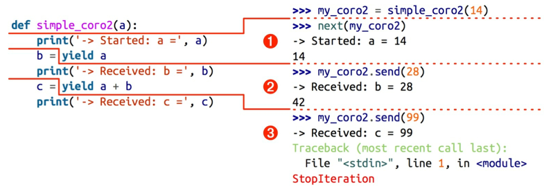

# 流畅的python


## 字典和集合

与字典有关的内置函数都在

```
__builtins__.__dict__
```

模块中。字典是依赖散列表的，还有集合也是如此。

- 常见的字典方法
- 如何处理查找不到的键
- 标准库中 dict 类型的变种 set 和 frozenset 类型
- 散列表的工作原理
- 散列表带来的潜在影响（什么样的数据类型可作为键、不可预知的 顺序，等等）

在`collections.abc`模块中有一个`MutableMapping`和他的超类`UML`。这两个类主要是作为形式化的文档使用，作为最基本的接口模板。

要使一个对象是可散列的，需要实现`__hash__()`和`__qe__()`方法。

注意不仅仅由列表推导式，还有字典推导式。

书中主要探讨了三个字典类

```
dict
collections.defaultdict   
collections.OrderedDict  输入键值对是有顺序的
```

他们包含了很多通用的方法，这些方法见书p137。

其中使用频率最高的应该是`setdefault`这个函数。这个函数会处理找不到的建，如果给定的建找不到，那么他会创建这个键并赋予相应的默认值。如果找到了，会返回设定的默认值。

我觉得这个功能最有用的地方就是对字典的初始化了。就相当字典键带有了初始化值。

### 如何处理找不到的键

1. 使用`defaultdict`这个类型。
2. 子类化`dict`类。

`defaultdict`位于`collections`模块中，即`collections.defaultdict`。

在实例化一个 defaultdict 的时候，需要给构造方法提供 一个可调用对象，这个可调用对象会在 `__getitem__` 碰到找不到的键的时候被调用，让 `__getitem__` 返回某种默认值。 

```python
import collections
defaultdict = collections.defaultdict(list)
```

这样`defaultdict`在找不键的时候就会返回一个列表（注意list是个可调用对象）。

这个用来生成默认值的可调用对象存放在名为 default_factory 的 实例属性里。这个default_factory只在`__getitem__`里面被调用，在其他的地方并不发挥作用。

背后主要是使用了`__missing__`方法。所有映射类型在找不到键的情况下都会调用`__missing__`方法（不过dict类并没有实现这个方法）。**`__missing__`方法只会被`__getitem__`调用**。

### 其他的字典类型

`collections.OrderdDict`这个类会在添加键的时候保持顺序，因此键的迭代次序总是一致的。

`collections.ChainMap`容纳多个不同的映射对象，然后在进行键查找的时候，这些对象会被当做一个整体逐个查找，直到键被找到为止。

```
collections.ChainMap(locals(),globals(),vars(builtins))
```

`collections.Counter`这个类型，给键准备了一个整数计数器。每次更新一个键的时候都会增加这个计数器。

`collections.UserDict`只是将dict类用python实现了一遍，但为什么这样做？主要是为了能够使这个类更方便继承，使用户写出自己的字典类。

## 集合

集合中的元素也是可散列的。set集合本身是不可散列的，但是frozenset可以。

纯集合的运算也是相当快速的。而且集合实现了很多中缀表达式。

```
a | b,   a & b,    a - b
```

p161列出了很多集合所能做出的操作。

集合的操作很高效的原因是散列表，但是散列表是使用空间换时间的。他在空间上消耗很大，因为散列表是一个稀疏矩阵。当向散列表中添加键的时候，有可能是需要扩充散列表的大小的，此时键的顺序就会发生改变。而且在计算哈希值的时候有可能计算出的哈希值是相似的，那就需要再计算一次。

## 一等函数

一等函数的标准是

- 运行时创建
- 能赋值给变量或数据结构中的元素
- 能作为参数传给函数
- 能作为函数的返回结果

### 高阶函数

接受函数为参数，或者把函数作为结果返回的函数就是高阶函数。

例如map和sorted就是高阶函数。


### 匿名函数

匿名函数就是lambda表达式，在python中匿名函数是有限制的，只能使用纯表达式。这正使他能够方便的使用在参数列表中

```python
sorted(fruits, key=lambda word: word[::-1])
```


###  可调用对象

在python中有7中可调用对象，

1. 用户定义的函数：def     lambda表达式
2. 内置函数：
3. 内置方法：
4. 方法：在类中定义的函数
5. 类：
6. 类的实例：
7. 生成器函数：

判定一个对象是否是可调用的只要使用callable()


### 用户定义的可调用对象

只要实现了`__call__`实例方法，任何对象都可以是可调用的。

```python
import random
class BingoCage:
	def __init__(self,items):
	    self._items = list(items)
	    random.shuffle(self._items)
	def pick(self):
	    try:
	        return self._items.pop()
	    except IndexError:
	        raise LookupError("pick from empty BingoCage")
	def __call__(self):
	    return self.pick()
```

bingo.pick()的快捷方式是bingo()

### 函数内省

我理解的内省就是  向内做检查，即自我检查。


#### 定位参数和仅限关键字参数

````python
def tag(name, *content, cls=None, **sttrs)；
    """生成一个或者多个HTML标签"""
	if cls is not None:
        attrs["class"] = cls
    if attrs:
        attr_str = ''.join('%s=%s'%(attr，value) 
                               for attr, value in sorted(attrs.items()))
    else:
        attr_str = ''
    if content:
        return '\n'.join('<%s%s>%s<%s>'%(name,attr_str,c,name) for c in content)
    else:
         return '<%s%s />' % (name,sttr_str)
````

输出效果

```html
tag('br') >>>> '<br />' 这个相当于，cls=None content=None sttrs=None 直接执行最后一句

 tag('p', 'hello') >>>>  '<p>hello</p>'  此时相当于name 和content有值。执行倒数第二句，一个生成器。不断换c的值
 
 tag('p', 'hello', 'world') >>>>  <p>hello</p>       <p>world</p>  如上，此时就生成了两个
 
 tag('p', 'hello', id=33)  >>>> <p id="33">hello</p>   id=33 就用到了关键字参数。解包之后使用
 
 tag('p', 'hello', 'world', cls='sidebar') >>>>  <p class="sidebar">hello</p> 
                                                 <p class="sidebar">world</p> 
                                                 
 tag(content='testing', name="img")   >>>>   
 
 my_tag = {'name': 'img', 'title': 'Sunset Boulevard', 'src': 'sunset.jpg', 'cls': 'framed'} 
  tag(**my_tag) 
 
 
```

第一个参数后任意个参数会被*content捕获，存入一个元组。没有明确指定名称的参数，会被**attrs捕获，存入一个字典。而cls参数只能作为关键字参数传入。它一定不会捕获未命名的定位参数。

定义函数时若想指定仅限关键字参数，要把它们放到前面有 * 的**参数**后面。如果不想支持数量不定的位置参数，但是想支持仅限关键字参数，在签名中放 一个 *

````
def f(a,*,b):
    return a,b
````

### 获取参数的信息

在函数对象中有一个`__defaults__`属性，他的值是元组，其中存放的是**位置参数和关键字参数**的***默认值***。而仅限关键字参数的默认值是放在`__kedefaults__`中的。

但是参数的名称是放在`__code__`属性中的。在code中参数的名称是放在`__code__.co_varnames`中的，但是其中还存放了函数中创建的局部变量。函数参数是`__code__.co_varnames`中前N个数，N的数值是由`__code__.co_argcount`所确定的。

python中有一个模块———inspect，来处理相同功


### 装饰器

装饰器的基本知识

- python如何计算装饰器句法
- python如何判断变量是不是局部的
- 闭包存在的原因和工作原理
- nonlocal能解决什么问题

更近一步

- 如何实现行为良好的装饰器
- 标准库中有用的装饰器
- 实现一个参数化的装饰器

-----------------------

1.装饰器的用法

```python
@decorate
def target():
    print("running target()")
```

上述代码如下写法相同

```python
def targer():
   print("running target()")

target = decorate(target)  # 以目标函数为参数，再返回与目标函数同名的函数，但实际上函数名已经绑定到其他地址了。
```

装饰器的一大特性是：将被装饰的函数换成其他函数。第二个特性是：装饰器**在加载模块时立即执行**。

```python
registry = []
def register(func):
    print("running register(%s)" % func)
    registry.append(func)
    return func
@register
def f1():
    print("running f1()")
    
@register
def f2():
    print("running f2()")
    
def f3():
    print("running f3()")
    
def main():
    print("running main()")
    print("register ->", register)
    f1()
    f2()
    f3()
if __name__ == ""
```

在真正代码中装饰器有几个特性：

- 装饰器函数与被装饰函数通常是分开定义的。装饰器通常在一个模块中定义，然后应用到其他模块中的函数上。
- 装饰器返回的函数，通常与传入的函数不是同意个函数。大多数情况下，装饰器会在内部定义一个函数，然后将其返回。

2.变量作用域规则

python不要求声明变量，但是假定在函数定义体中赋值的变量是局部变量。

3.闭包

闭包是指延伸了作用域的函数，其中包含函数定义体中  引用了、但是不在定义体中定义的非全局变量。函数是不是匿名没有关系，关键是他能够访问定义体之外定义的非全局变量。

```python
def make_averager()
  # --------闭包---------------
	series = []  
    def averager(new_value)
    	series.append(new_value)  # 自由变量series
        total = sum(series)
        return total/len(series)
  # --------闭包----------------
```

4.nonlocal 的变量作用域

```python
def make_averager():
    count = 0
    total = 0
    def averager(new_value):
        count += 1
        total += new_value
        return total / count
```

上面的函数是对之前函数的改进，但是，在运行过程中会出错。因为对 count+=1 会使他变为局部变量，total也相同。因此python中引入了nonlocal关键字，来处理局部和全局变量之间的那层变量。

- nonlocal的作用是把变量标记为自由变量，即使在函数中为变量赋予新值，也不会改变自由变量


更新如下

```python
def make_averager():
    count = 0
    total = 0
    def averager(new_value):
        nonlocal count, total
        count += 1
        total += new_value
        return total / count
```

5.一个简单的例子

```python
# clockdeco.py
import time

def clock(func):
    def clocked(*args):
        t0 = time.perf_counter()
        result = func(*args)
        elapsed = time.perf_counter() - t0
        name = func.__name__
        arg_str = ", ".join(repr(arg) for arg in args)
        print("[%0.8fs] %s(%s) -> %r" % (elapsed, name, arg_str, result))
        return result
    return clocked
```

将一个函数的运行的时间，传入的参数和调用的结果显示出来。

```python
import time
from clockdeco import clock
@clock
def snooze(seconds):
    time.sleep(seconds)
    
@clock
def factorial(n):
    return 1 if n < 2 else n*factorial(n-1)

if __name__ == "__main__":
    print("*" * 40, "calling snooze(.123)")
    snooze(.123)
    print("*" * 40, "calling factorial(6)")
    print("6! =", factorial(6))
```

这是装饰器比较经典的作用，把装饰的函数替换成新的函数，二者接受相同的参数，而且返回被装饰的函数本该返回的值，同时还会做一些额外的操作。

上面clock装饰器，掩盖了`__name__`  和 `__doc__` 属性。而functool.wraps 装饰器能把相关属性从func复制到clocked中，而且还能正确处理关键字参数，这是一种加强的操作。

```python
import time
import functools

def clock(func):
    @functools.wraps(func)
    def clocked(*args,**kwargs):
        t0 = time.time()
        result = func(*args, **kwargs)
        elapsed = time.time() - t0
        name = func.__name__
        arg_lst = []
        if args:
            arg_lst.append(", ".join(repr(arg) for arg in args))
        if kwargs:
            pairs = ["%s=%r" % (k, w) for k, w in sorted(kwargs.items())]
            arg_lst.append(", ".join(arg_lst))
        arg_str = ", ".join(arg_lst)
        print("[%0.8fs] %s(%s) -> %r" % (elapsed, name, arg_str, result))
        return result
    return clocked
```

6.标准库中的装饰器

**functools.lru_cache**

他实现了备忘功能，**他把耗时的函数的结果保存起来**，避免传入相同的参数时重复计算。LRU是"Least Recently Used"的缩写，表明缓存不会无限制增长，一段时间不用的缓存条目会被扔掉。

生成第n个斐波那契数这种慢速递归函数特别适合使用lru_cache。

```python
import functools
from clockdeco import clock

@functools.lru_cache()  # 必须有一对括号
@clock
def fibonacci(n):
    if n < 2:
        return n
    return fibonacci(n-2) + fibonacci(n-1)

if __name__ == "__main__":
    print(fibonacci(6))
```

lru_cache可以使用两个参数。

```python
functools.lru_cache(maxsize=128, typed=False)
```

maxsize参数指定存储多少个调用的结果（最好是2的幂次方）。缓存满了之后，旧的结果会被抛弃。

typed参数如果设为True，会把不同参数类型得到的结果分开保存，即把通常认为相等的浮点数和整数参数（如1和1.0）区分开。

因为lru_cache使用字典存储结果，而且键根据调用时传入的定位参数和关键字参数创建，所以被lru_cache装饰的函数，他的所有参数都必须是可散列的。


**functools.singledispatch**

单分派泛函数

类似于重载函数，但python本身并不存在方法重载。

```python
import html
def htmlize(obj):
    content = html.escape(repr(obj))
    return "<pre>{}</pre>".format(content)
```

在Python中，一种常见的做法是把htmlize变成一个分派函数，使用一串if/elif/elif，调用专门的函数，如htmlize_str、htmlize_int等。这样不便于模块的用户扩展，还很笨。时间一长，分派函数htmlize会变得很大，而且他与各个专门函数之间的耦合也很紧密。

```python
from functools import singledispatch
from collections import abc
import numbers
import html

@singledispatch  # singledispatch标记处理object类型的基函数
def htmlize(obj):
    content = html.escape(repr(obj))
    return "<pre>{}</pre>".format(content)

@htmlize.register(str)  # 各个专门函数使用<<base_function>>.register(<<type>>)装饰
def _(text):
    content = html.escape(text).replace("\n", "<br>\n")
    return "<p>{0}</p>".format(n)

@htmlize.register(numbers.Integral)  # numbers.Integral是int的虚拟超类
def _(n):
    return "<pre>{0} (0x{0:x})</pre>".format(n)

@htmlize.register(tuple)  # 可以叠放多个register装饰器，让同一个函数支持不同类型
@htmlize.register(abc.MutableSequence)
def _(seq):
    inner = "</li>\n<li>".join(htmlize(item) for item in seq)
    return "<ul>\n<li>" + inner + "</li>\n<ul>"

```

注册的专门函数应该处理抽象基类（如numbers.Integral和abc.MutableSequence），不要处理具体实现(int和list)。

singledispatch机制的一个显著的特征是，你可以在系统的任何地方和任何模块中注册专门函数。如果后来在新的模块中定义了新的类型，可以轻松地添加一个新的专门函数来处理那个类型。此外，你还可以为不是自己编写的或者不能修改的类添加自定义函数。

7.参数化装饰器

怎么让装饰器接受其他参数？创建一个装饰器工厂函数，把参数传给他，返回一个装饰器，然后再把它应用到要装饰的函数上。

下面的函数不是装饰器，而是装饰器工厂函数。调用他会返回真正的装饰器，这才是应用到目标函数上的装饰器。

```python
register = set()
def register(active=True):
    def decorate(func):
        print("running register(active=%s)->decorate(%s)" % (active, func))
    	if active:
        	register.add(func)
    	else:
        	register.discard(func)
    	return func
    return decorate

@register(active=False)  # 工厂函数必须作为函数调用，并且传入所需的参数。
def f1():
    print("running f1()")

@register()  # 必须作为函数调用
def f2():
    print("running f2()")

def f3():
    print("running f3()")

```


参数化clock装饰器

添加一个功能，让用户传入一个格式化字符串，控制被装饰函数的输出。

```python
import time
DEFAULT_FMT = "[{elapsed:0.8f}s] {name}({args}) -> {result}"

def clock(fmt = DEFAULT_FMT):  # 装饰器工厂函数。。这一层只是为了能够使装饰器有参数
    def decorate(func):  # 真正的装饰器。。 从func看出，这一层使用要传入要包装的函数的
        def clocked(*_args):  # 包装被装饰的函数。。而这一层是为了能够使用被包装函数的参数
            t0 = time.time()
            _result = func(*_args)
            elapsed = time.time() - t0
            name = func.__name__
            args = ", ".join(repr(arg) for arg in _args)
            result = repr(_result)
            print(fmt.format(**locals()))
            return _result  # 真正被返回的值
        return clocked
    return decorate
if __name__ == "__main__":
    @clock()
    def snooze(seconds):
        time.sleep(seconds)
    
    for i in range(3):
        snooze(.123)
    
    @clock("{name}:{elapsed}s")
    def snooze(seconds):
        time.sleep(seconds)
    for i in range(3):
        snooze(.123)
```


## 对象引用、可变性和垃圾回收机制

### 变量不是盒子

变量不是盒子是说：变量不是实际的装有数据，而是说，变量引用了数据。至少对python来讲是这样的。

对引用式变量来说，把变量分配给对象更为合理，反过来说就有问题。这是说，把变量分配给一个对象，通过这个变量来使用这个对象。

此时使用**标注**来形容变量，便比较恰当。这就是对实际的对象或者数据打上了一个标签，而标签可以有很多个。此时这些标签就是别名。


### 标识、相等性、别名

```python
charles = {"name":"Cher Le", "born":"1999"}  
lewis = charles  # lewis 相当于是别名
lewis is charles  # 两者是相等的
id(lewis) == id(charles)  # 两者的标识是相等的。也就是id相同。

alex = {"name":"Cher Le", "born":"1999"}  
charles == alex  # 两者的值相同
charles is not alex  # 但是两者并不是同一个对象
```

每个变量都有标识、类型和值，对象一旦建立，他的标识是不会变的。

由上面的比较就引出了对`is`和`==`比较的问题。

`==`使用的是`__eq__`方法来检查两者是不是相同。而is是使用id()函数判断两者是不是同一个对象。比较来说，is会比`==`快。但是更多的情况是，比较两个变量的值是不是相同，而不是判断两个变量是不是同一个对象。

这个时候就引出了元组可变与不可变的问题。

### 元组的相对不可变性

元组是不可变的，但是如果元组内有类似列表一样的可变元素的时候，可以向这个列表中添加值，原则就是可变的了。主要原因应该还是因为元组中其实存储的是列表的首地址，这个地址本质还是没变的。

```python
t1 = (1, 2, [30, 40])
```


### 深复制和浅复制

默认情况下是做浅复制的，浅复制本质上没有问题，但是如果复制的对象中存在可变对象的话，会有影响。因为其中的可变元素可能还是引用同一个对象。

```
[3, [123, 444], (214,553)]
```

那么这就引出如何做深复制？

使用copy中的deepcopy()函数。

```python
import copy
a = copy.deepcopy(b)
```


### 函数参数

函数的参数在传递过程中，python传递的都是变量的引用。对于这些引用的修改都会生成新的局部变量，进而屏蔽掉全局变量。但是可以将列表等可变类型进行传递，进而改变参数的值，但是这样做是相当危险的。

```python
class HauntedBus:
    def __init__(self,passengers=[]):
        self.passengers = passengers
    def pick(self,name):
        self.passengers.append(name)
    def drop(self,name):
        self.passengers.remove(name)
```

在实例化的时候，如果给定了初始值，那么相当于passengers绑定了一个变量地址，

```python
bus1 = HauntedBus(["Alice", "Bill"])
```

此时多个对象之间不会出现问题，

但是如果实例化了几个对象都没有初始化。那么他们的passengers会绑定同一个空列表的地址，

```
bus2 = HauntedBus()
bus3 = HauntedBus()
```

当改变bus2的值的时候，bus3的值也会改变，而这样的错误难以察觉。

正确的做法应该是

```python
def __init__(self,passengers=None):
    if passengers in None:
        self.passengers = []  # 不直接绑定可变对象
    else:
        self.passengers = list(passengers)  # 为参数重新生成变量，防止函数内部的修改影响到外部
```


### 垃圾回收机制

垃圾回收机制，python会对不在有引用计数的变量进行回收，当然可以手动的清除对象的引用，那就是使用`del`。

当然可以使自己的类型实现`__del__`方法来进行删除操作，但是，这并不容易实现。接下来讲的就是弱引用。

### 弱引用

当对象被引用的时候会增加引用计数，而弱引用就是：引用了对象，但是不增加引用计数，当然代价就是：当一个对象的引用计数为零后，弱引用就会返回None，因为他并不是真正的引用。

python中实现弱引用的实现是

```python
import weakref
```

```python
import weakref
a = {0, 1}
wref = weakref.ref(a)
wref()
>>> {0, 1}
```

`weakref.ref`是底层实现，不推荐直接使用。

而`WeakValueDictionary`是可变映射（从名字上可以看出来这是个字典），里面的值是对象的弱引用。当引用的值被垃圾回收后，其中的键会被自动删除。

````python
class Cheese:
    def __init__(self, kind):
        self.kind = kind
    def __repr__(self):
        return "Cheese(%r)" %self.kind
    
stock = weakref.WeakValueDictionary()
catalog = [Cheese("Red"), Cheese("Green"), Cheese("Blue"), Cheese("Grey")]
for cheese in catalog:
    stock[cheese.kind] = cheese
del catalog  # stock只剩"Grey"
del cheese # 全部删除，因为最后的cheese保留了一个Grey
````

与`WeakValueDictionary`对应的是`WeakKeyDictionary`其中key是弱引用。还有一个`WeakSet`，一个弱引用的集合。如果一个类需要知道他的所有实例，可以使用弱引用保存这些实例，不用Set是因为，这样实例永远不会被释放了，知道程序结束。

弱引用的局限：并不是所有python对象都可以作为弱引用的目标。int和tuple就不行。


## python风格的对象

python风格我的理解就是，自定义的数据类型，实现了python自带的魔术方法，从而表现的如同python自带的数据类型一样。

### 对象表示形式

python提供两种表示形式

```
repr()   便于开发者理解的方式返回对象的字符串表示形式
str()   便于用户理解的方式返回对象的字符串表示形式
```

这两个函数由`__repr__`和`__str__`两个方法提供实现。

同时还有个两个`__bytes__`和`__format__`，他们一个是提供对字符的编码，一个提供格式化的输出形式。

### 举个例子

实现一个向量类的表示

```python
"""测试用例
A two-dimensional vector class
    >>> v1 = Vector2d(3, 4)
    >>> print(v1.x, v1.y)
    3.0 4.0
    >>> x, y = v1
    >>> x, y
    (3.0, 4.0)
     >>> v1
     Vector2d(3.0, 4.0)
     >>> v1_clone = eval(repr(v1))
     >>> v1 == v1_clone
     True
     >>> print(v1)
     (3.0, 4.0)
     >>> octets = bytes(v1)
     >>> octets
     b'd\\x00\\x00\\x00\\x00\\x00\\x00\\x08@\\x00\\x00\\x00\\x00\\x00\\x00\\x10@'
     >>> abs(v1)
     5.0
     >>> bool(v1), bool(Vector2d(0, 0))
     (True, False)

Test of  ``.frombytes()`` class method:
    >>> v1_clone = Vector2d.frombytes(bytes(v1))
    >>> v1_clone
    Vector2d(3.0, 4.0)
    >>> v1 == v1_clone
    True

Tests of ``format()``with Cartesian coordinates:
    >>> format(v1)
    '(3.0, 4.0)'
    >>> format(v1, '.2f')
    '(3.00, 4.00)'
    >>> format(v1, '.3e')
    '(3.000e+00, 4.000e+00)'

Tests of the ``angle`` method::
    >>> Vector2d(0, 0).angle()
    0.0
    >>> Vector2d(1, 0).angle()
    0.0
    >>> epsilon = 10**-8
    >>> abs(Vector2d(0, 1).angle() - math.pi/2) < epsilon
    True
    >>> abs(Vector2d(1, 1).angle() - math.pi/4) < epsilon
    True

Tests of ``format()`` with polar coordinates:
    >>> format(Vector2d(1, 1), 'p')  # doctest:+ELLIPSIS
    '<1.414213..., 0.785398...>'
    >>> format(Vector2d(1, 1), '.3ep')
    '<1.414e+00, 7.854e-01>'
    >>> format(Vector2d(1, 1), '0.5fp')
    '<1.41421, 0.78540>'

Tests of `x` and `y` read-only properties:
    >>> v1.x, v1.y
    (3.0, 4.0)
    >>> v1.x = 123
    Traceback (most recent call last):
    ...
    AttributeError: can't set attribute

Tests of hashing:
    >>> v1 = Vector2d(3, 4)
    >>> v2 = Vector2d(3.1, 4.2)
    >>> hash(v1), hash(v2)
    (7, 384307168202284039)
    >>> len(set([v1, v2]))
    2
"""
from array import array
import math

class Vector2d:
    typecode = 'd'

    # def __init__(self, x, y):
    #     self.x = float(x)
    #     self.y = float(y)
    def __init__(self, x, y):
        self.__x = float(x)  # 双下划线的
        self.__y = float(y)

    @property
    def x(self):
        """变成只读了。属性"""
        return self.__x

    @property
    def y(self):
        return self.__y

    def __iter__(self):
        return (i for i in (self.x, self.y))

    def __hash__(self):
        return hash(self.x) ^ hash(self.y)  # 变为散列的对象，是需要实现`__hash__`，但是hash需要值是不可变的。因而上面通过使用@property将和__x等将属性固定。

    def __repr__(self):
        class_name = type(self).__name__
        return '{}({!r}, {!r})'.format(class_name, *self)  # format格式{0.mass:5.3e}。0和mass都算是这个{}字段的名字，:号后面是格式说明符。

    def __str__(self):
        return str(tuple(self))

    def __bytes__(self):
        return bytes([ord(self.typecode)]) + bytes(array(self.typecode, self))

    def __eq__(self, other):
        return tuple(self) == tuple(other)

    def __abs__(self):
        return math.hypot(self.x, self.y)

    def __bool__(self):
        return bool(abs(self))

    def angle(self):
        return math.atan2(self.y, self.x)

    @classmethod
    def frombytes(cls, octets):
        """从序列读出字符串
           一个新的构造方法，
        """
        typecode = chr(octets[0])
        memv = memoryview(octets[1:]).cast(typecode)
        return cls(*memv)  # cls会返回新的实例

    # def __format__(self, format_spec=''):
    #     components = (format(c, format_spec) for c in self)
    #     return '({}, {})'.format(*components)
    def __format__(self, format_spec):
        if format_spec.endswith('p'):
            format_spec = format_spec[:-1]
            coords = (abs(self),self.angle())
            outer_fmt = '<{}, {}>'
        else:
            coords = self
            outer_fmt = '({}, {})'
        components = (format(c, format_spec) for c in coords)
        return outer_fmt.format(*components)

```


### 类方法和静态方法

类方法和静态方法通过使用装饰器`@classmthod`和`@staticmethod`实现

```python
class Demo:
    @classmethod
    def klassmeth(*args):  # 类方法
        return args
    @staticmethod
    def statmeth(*args):  # 静态方法
        return args 
    
>>>Demo.klassmeth()
(<class '__main__.Demo'>,)  # 类方法是绑定在类上的，这从他第一个参数可以看出
>>>Demo.klassmeth('spam')
(<class '__main__.Demo'>, 'spam')
>>>Demo.statmeth()  # 静态方法和不同的函数相同，只是他比较靠近类。
()
>>>Demo.statmeth('spam')
('spam', )
        
```


### Python的私有属性和“受保护的”属性

通过实现双下划线，可以实现对属性名称进行改名，比如以`__mod`命名属性，python将其存入实例的`__dict__`属性中，而且会在前面加上下划线和类名。对于A来说，他就变成`_A__mod`。

这样的设置只是为了防止意外修改的发生，但是你还是能通过`_A__mod`对属性进行修改，但这是强制性的。

另一种形式是单下划线，`_mod`，这被称为是私有属性，但是这更多的是程序员约定的规则。


### 使用`__slots__`类属性节省内存空间

在各个实例中，`__dict__`的字典中存储实例属性，但是字典会消耗大量的内存。通过`__slots__`让解释器在元组中存储实例属性，而不使用字典。

继承自超类的`__slots__`属性没有效果。python只会使用各个类中定义的`__slots__`属性。

定义`__slots__` 的方式是，创建一个类属性，使用 `__slots__`这个名 字，并把它的值设为一个字符串构成的可迭代对象，其中各个元素表示各个实例属性。

```python
class Vector2d:
    __slots__ = ('__x', '__y')
    typecode = 'd'
```

在类中定义`__slots__`属性的目的是告诉解释器：“这个类中的所有实 例属性都在这儿了！”这样，Python 会在各个实例中使用类似元组的结 构存储实例变量，从而避免使用消耗内存的`__dict__`属性。如

在类中定义`__slots__`属性之后，实例不能再有`__slots__`中所列名称之外的其他属性。这只是一个副作用，不是 `__slots__`存在的真正原因。不要使用 `__slots__`属性禁止类的 用户新增实例属性。`__slots__`是用于优化的，不是为了约束程序员。

如果把 `'__dict__'` 这个名称 添加到 `__slots__` 中，实例会在元组中保存各个实例的属性，此外还支持动态创建属性，这些属性存储在常规的 `'__dict__'`中。当然，把 `__dict__ 添加到 `__slots__`中可能完全违背了初衷，这取决于各个 实例的静态属性和动态属性的数量及其用法

用户定义的类中 默认就有 `__weakref__ `属性。可是，如果类中定义了` __slots__ `属 性，而且想把实例作为弱引用的目标，那么要把 `'__weakref__' `添加 到 `__slots__` 中。 


### 覆盖类属性

Vector2d 中有个 `typecode` 类属性，`__bytes__` 方法两次用到了 它，而且都故意使用 `self.typecode` 读取它的值。如果为不存在的实例属性赋值，会新建实例属性。假如我们为 `typecode`实例属性赋值，那么同名类属性不受影响。然而，自此之 后，实例读取的 `self.typecode` 是实例属性 `typecode`，也就是把同 名类属性遮盖了。

如果想修改类属性的值，要直接在类上修改。

```python
Vector2d.typecode = 'f'
```

修改子类的属性，需要继承

```python
from vector2d import Vector2d
class ShortVector2d(Vector2d):
    typecode = 'f'
```

这样就只会影响子类的属性。而且每个类可以设置不同的值。


## 序列的修改、散列和切片

首先什么是鸭子类型，叫起来像，看起来像，用起来像，那这就是鸭子，不要检查他是不是。

其实这核心说的是，只要实现python中已经定义的接口或者协议，那么这个新的类型就属于协议所属的那个类型。

以序列类型为背景说明python的几个特殊方法。

vector 第一版  与vector2d兼容

```python
class vector_v1:
    """实现序列协议"""
    typecode = 'd'

    def __init__(self, components):
        """接收可迭代的对象作为参数，内置类型都是这么做的"""
        self._components = array(self.typecode, components)  

    def __iter__(self):
        return iter(self._components)

    def __repr__(self):
        # 获取 self._components 的有限长度表示形式(如 array('d', [0.0, 1.0, 2.0, 3.0, 4.0, ...]))。
        # reprlib.repr实现有限长度的显示，python2中是repr
        components = reprlib.repr(self._components)
        # 把字符串插入 Vector 的构造方法调用之前，去掉前面的 array('d' 和后面的 )。
        components = components[components.find('['):-1]
        return "Vector({})".format(components)

    def __str__(self):
        return str(tuple(self))

    def __bytes__(self):
        return bytes([ord(self.typecode)]) + bytes(self._components)

    def __eq__(self, other):
        return tuple(self) == tuple(other)

    def __abs__(self):
        return math.sqrt(sum(x * x for x in self))

    def __bool__(self):
        return bool(abs(self))

    @classmethod
    def frombytes(cls, octets):
        """从字节序列返回一个新的实例"""
        typecode = chr(octets[0])
        memv = memoryview(octets[1:]).cast(typecode)
        return cls(memv)

```


在面向对象编程中，协议是非正式的接口，只在文档中定义，在代码中不定义。例如，Python 的序列协议只需要 `__len__` 和 `__getitem__` 两 个方法。任何类（如 Spam），只要使用标准的签名和语义实现了这两 个方法，就能用在任何期待序列的地方。

```python
import collections
Card = collections.namedtuple("Card", ['rank', 'suit'])

class FrenchDeck:
    """接口协议"""
    ranks = [str(n) for n in range(2, 11)] + list("JQKA")
    suits = 'spads diamonds clude hearts'.split()

    def __init__(self):
        self._cards = [Card(rank, suit) for suit in self.suits for rank in self.ranks]

    def __len__(self):
        return len(self._cards)

    def __getitem__(self, item):
        return self._cards[item]

```

通过`__len__`和`__getitem__`方法可以使FrenchDeck表现的像序列。

vector的第二版，支持序列的切片。

```python
class Vector:
    def __len__(self):
        return len(self._components)
    def __getitem__(self, index):
        return self._components[index]
```

`__getitem__`方法会返序列的切片，但他返回的数组类型，但是数组类型就丧失了Vector类很多特性。如果能返回Vector类就更好了。

### 切片的原理

```python
>>> class MySeq:     
    def __getitem__(self, index):  
        return index
>>> s = MySeq() 
>>> s[1] 
1

>>> s[1:4]   
slice(1, 4, None)   # 他的返回类型改变了，v2版本正是利用了这一特性。

>>> s[1:4:2]  
slice(1, 4, 2) 

>>> s[1:4:2, 9]  
(slice(1, 4, 2), 9) 

>>> s[1:4:2, 7:9]  
(slice(1, 4, 2), slice(7, 9, None))
```

**从1：4开始，返回的类型变成slice**。slice是内置类型，他有一个indices属性

```python
help(slice.indices)
S.indices(len) -> (start, stop, stride)
```

给定长度为 len 的序列，计算 S 表示的扩展切片的起始（start） 和结尾（stop）索引，以及步幅（stride）。超出边界的索引会被截掉，这与常规切片的处理方式一样。

这个方法会“整顿”元组，把 start、stop 和 stride 都变成非负数，而且都落在指定长度序列的边界内。

这是实现序列切片的底层方法。现在我们不需要使用他，但是底层是与之类似的方法。

```python
slice(None, 10,2).indices(5)
(0,5,2)

slice(-3, None, None).indices(5)
(2,5,1)
```

### 能处理切片的`__getitem__`方法

```python
class vector_v2:
    """实现序列协议"""
    typecode = 'd'

    def __init__(self, components):
        """接收可迭代的对象作为参数，内置类型都是这么做的"""
        self._components = array(self.typecode, components)  

    def __iter__(self):
        return iter(self._components)

    def __repr__(self):
        # 获取 self._components 的有限长度表示形式(如 array('d', [0.0, 1.0, 2.0, 3.0, 4.0, ...]))。
        # reprlib.repr实现有限长度的显示，python2中是repr
        components = reprlib.repr(self._components)
        # 把字符串插入 Vector 的构造方法调用之前，去掉前面的 array('d' 和后面的 )。
        components = components[components.find('['):-1]
        return "Vector({})".format(components)

    def __str__(self):
        return str(tuple(self))

    def __bytes__(self):
        return bytes([ord(self.typecode)]) + bytes(self._components)

    def __eq__(self, other):
        return tuple(self) == tuple(other)

    def __abs__(self):
        return math.sqrt(sum(x * x for x in self))

    def __bool__(self):
        return bool(abs(self))

    @classmethod
    def frombytes(cls, octets):
        """从字节序列返回一个新的实例"""
        typecode = chr(octets[0])
        memv = memoryview(octets[1:]).cast(typecode)
        return cls(memv)
    
    def __len__(self):
        return len(self._components)
    
    def __getitem__(self, index):
        cls = type(self)
        if isinstance(index, slice):  # 如果是切片形式的索引如[1：5]，则index是slice类型的。
            return cls(self._components[index])
        elif isinstance(index, numbers.Integral):
            return self._components[index]
        else:
            msg = "{cls.__name__} indices must be integers"
            raise TypeError(msg.format(cls=cls))
```


### 能动态获取属性的Vector

想要获得如v.x   v.y  v.z的方式来获取v中特定的属性值，如向量Vector中前三个分量。

```python
>>> v = Vector(range(10))
>>> v.x
0.0
>>> x.y, v.z, v.t
(1.0, 2.0, 3.0)
```

在 Vector2d 中，我们使用 @property 装饰器把 x 和 y 标记为只读特性（见示例 9-7）。我们可以在 Vector 中编写四个特性，但这样太麻烦。特殊方法 `__getattr__ `提供了更好的方式。

属性查找失败后，解释器会调用 `__getattr__` 方法。简单来说，对 my_obj.x 表达式，Python 会检查 my_obj 实例有没有名为 x 的属性； 如果没有，到类（my_obj.`__class__`）中查找；如果还没有，顺着继 承树继续查找。 如果依旧找不到，调用 my_obj 所属类中定义的 `__getattr__`方法，传入 self 和属性名称的字符串形式（如 'x'）。

```python
shortcut_name = 'xyzt'
def __getattr__(self, name):
    cls = type(self)
    if len(name) == 1:
        pos = cls.shortcut_names.find(name)  # 获取单个字母的位置
        if 0 <= pos < len(self._components):  # 如果位置合适
            return self._components[pos]  # 返回对应位置
    msg = '{.__name__ !r} object has no attribute {!r}'  
    raise AttributeError(msg.format(cls, name))  # 不是其中就返回错误
```

现在这并不是完美的还是有问题的

```python
>>> v = Vector(range(5)) 
>>> v Vector([0.0, 1.0, 2.0, 3.0, 4.0]) 
>>> v.x
0.0 
>>> v.x = 10  # 赋值为实例增加了一个x属性。
>>> v.x
10 
>>> v 
Vector([0.0, 1.0, 2.0, 3.0, 4.0])
```

这样的错误是因为`__getattr__`的运作方式导致的：仅当对象没有指定名称的属性时，Python才会调用那个方法，这是一i中后备机制。

`__getattr__`和`__setattr__`应该配合使用，以保证在设置新属性时，拒绝。

```python
def __setattr__(self, name, value):
    cls = type(self)
    if len(name) == 1:
        if name in cls.shortcut_names:
            error = 'readonly attribute {attr_name!r}'
        elif name.islower():
            error = "can't set attributes 'a' to 'z' in {cls_name!r}"
        else:
            error = ''
        if error:
            msg = error.format(cls_name = cls.__name__, sttr_name = name)
            raise AttributeError(msg)
    super().__setattr__(name, value)
```

整理一下

```python
class Vector_v3:
    shortcut_name = 'xyzt'
    
    def __getattr__(self, name):
        cls = type(self)
        if len(name) == 1:
            pos = cls.shortcut_names.find(name)  # 获取单个字母的位置
            if 0 <= pos < len(self._components):  # 如果位置合适
                return self._components[pos]  # 返回对应位置
        msg = '{.__name__ !r} object has no attribute {!r}'  
        raise AttributeError(msg.format(cls, name))  # 不是其中就返回错误
        
    def __setattr__(self, name, value):
        cls = type(self)
        if len(name) == 1:
            if name in cls.shortcut_names:
                error = 'readonly attribute {attr_name!r}'
            elif name.islower():
                error = "can't set attributes 'a' to 'z' in {cls_name!r}"
            else:
                error = ''
            if error:
                msg = error.format(cls_name = cls.__name__, sttr_name = name)
                raise AttributeError(msg)
        super().__setattr__(name, value)
```

 

### 散列和快速等值

实现`__hash__`和`__eq__`，这会把Vector实例变成可散列的对象。

归约函数（reduce， sum， any，all）把序列或有限的可迭代对象变成一个聚合结果。本小节注重归约函数的使用。

```python
from array import array
import reprlib
import math
import functools
import operator

class Vector_v4:
    typecode = "d"
    def __eq__(self,other):
        if len(self) != len(other):
            return False
    for a,b in zip(self, other):
        if a != b:
            return False
    return True
    
    def __hash__(self):
        hashes = map(hash, self._components)
        return functools.reduce(operator.xor, hashes)
```


### 格式化

`__format__`方法，要使用球坐标来表示，这个向量  <r, Φ1,  Φ2,  Φ3>，其中r是模，余下三个是角坐标 。

两个辅助方法，angle(n) 计算角坐标，另一个是angles()，返回所有角坐标构成的可迭代对象。

```python
from array import array
import reprlib
import math
import numbers
import functools
import operator
import itertools

class vector_v5:
    """实现序列协议"""
    typecode = 'd'

    def __init__(self, components):
        """接收可迭代的对象作为参数，内置类型都是这么做的"""
        self._components = array(self.typecode, components)  

    def __iter__(self):
        return iter(self._components)

    def __repr__(self):
        # 获取 self._components 的有限长度表示形式(如 array('d', [0.0, 1.0, 2.0, 3.0, 4.0, ...]))。
        # reprlib.repr实现有限长度的显示，python2中是repr
        components = reprlib.repr(self._components)
        # 把字符串插入 Vector 的构造方法调用之前，去掉前面的 array('d' 和后面的 )。
        components = components[components.find('['):-1]
        return "Vector({})".format(components)

    def __str__(self):
        return str(tuple(self))

    def __bytes__(self):
        return bytes([ord(self.typecode)]) + bytes(self._components)

    def __abs__(self):
        return math.sqrt(sum(x * x for x in self))

    def __bool__(self):
        return bool(abs(self))

    @classmethod
    def frombytes(cls, octets):
        """从字节序列返回一个新的实例"""
        typecode = chr(octets[0])
        memv = memoryview(octets[1:]).cast(typecode)
        return cls(memv)
    
    def __len__(self):
        return len(self._components)
    
    def __getitem__(self, index):
        cls = type(self)
        if isinstance(index, slice):  # 如果是切片形式的索引如[1：5]，则index是slice类型的。
            return cls(self._components[index])
        elif isinstance(index, numbers.Integral):
            return self._components[index]
        else:
            msg = "{cls.__name__} indices must be integers"
            raise TypeError(msg.format(cls=cls))
    
    shortcut_name = 'xyzt'
    
    def __getattr__(self, name):
        cls = type(self)
        if len(name) == 1:
            pos = cls.shortcut_names.find(name)  # 获取单个字母的位置
            if 0 <= pos < len(self._components):  # 如果位置合适
                return self._components[pos]  # 返回对应位置
        msg = '{.__name__ !r} object has no attribute {!r}'  
        raise AttributeError(msg.format(cls, name))  # 不是其中就返回错误
        
    def __setattr__(self, name, value):
        cls = type(self)
        if len(name) == 1:
            if name in cls.shortcut_names:
                error = 'readonly attribute {attr_name!r}'
            elif name.islower():
                error = "can't set attributes 'a' to 'z' in {cls_name!r}"
            else:
                error = ''
            if error:
                msg = error.format(cls_name = cls.__name__, sttr_name = name)
                raise AttributeError(msg)
        super().__setattr__(name, value)
        
    def __eq__(self, other):
        if len(self) != len(other):
            return False
        for a,b in zip(self, other):
            if a != b:
                return False
        return True
    
    def __eq__(self, other):
        return len(self) == len(other) and all(a ==b for a, b in zip(self, other))
    
    def __hash__(self):
        hashes = map(hash, self._components)
        return functools.reduce(operator.xor, hashes)
    
    def angle(self, n):
        r = math.sqrt(sum(x * x for x in self[n:]))
        a = math.atan2(r, self[n-1])
        if (n == len(self) - 1) and (self[-1] < 0):
            return math.pi * 2 - a
        else:
            return a
        
    def angles(self):
        return (self.angle(n) for n in range(1, len(self)))
    
    def __format__(self, fmt_spec = ''):
        if fmt_spec.endwith('h'):
            fmt_spec = fmt_spec[:-1]
            coords = itertools.chain([abs(self)], self.angles())
            outer_fmt = '<{}>'  # 球面坐标
        else:
            coords = self
            outer_fmt = '({})'  # 迪卡儿坐标
        components = (format(c, fmt_spec) for c in coords)
        return outer_fmt.format(', '.join(components))
    
```


## 接口：从协议到抽象基类

从鸭子类型的代表特征动态协议，到使接口更明确、能验证实现是否符合规定的抽象基类。


## python中的接口和协议

除了抽象基类，每个类都有接口： 类实现或继承的公开属性（方法或数据属性），包括特殊方法，如 `__getitem__ `或 `__add__`。 按照定义，受保护的属性和私有属性不在接口中：即便“受保护的”属性也只是采用命名约定实现的（单个前导下划线）；私有属性可以轻松地访问。

不要觉得把公开数据属性放入对象的接口中不妥，因为如果需要，总能实现读值方法和设值方法，把数据属性变成特性，使用 obj.attr 句法的客户代码不会受到影响。

关于接口，这里有个实用的补充定义：对象公开方法的子集，让对象在系统中扮演特定的角色。接口是实现特定角色的方法集合。

### 序列的协议

实现一个`__getitem__`方法，只是实现序列协议的一部分，这就足够访问元素、迭代和使用in运算符了。

```python
class Foo:
    def __getitem__(self, pos):
        return range(0, 30, 10)[pos]
    
>>> f = Foo() 
>>> f[1] 
10 
>>> for i in f: print(i)
0 
10 
20 
>>> 20 in f 
True 
>>> 15 in f 
False
```

在这个FrenchDeck类中只实现了两个协议`__len__`和`__getitem__`

```python
import collections
Card = collections.namedtuple('Card', ['rank', 'suit'])
class FrenchDeck:    
    ranks = [str(n) for n in range(2, 11)] + list('JQKA')    
    suits = 'spades diamonds clubs hearts'.split()
    def __init__(self):        
        self._cards = [Card(rank, suit) for suit in self.suits for rank in self.ranks]
        
    def __len__(self):        
        return len(self._cards)
    
    def __getitem__(self, position):        
        return self._cards[position]
```


### 使用猴子补丁在运行时实现协议 

上面的FrenchDeck类无法完成洗牌的操作，因为他只实现了不可变序列的协议，想要完成洗牌的操作，必须将他变成可变序列，这只需实现`__setitem__`方法。

因为python是动态语言，因此可以在运行时修正这个问题。这叫做猴子补丁：在运行时修改类或模块，而不改动源码。猴子补丁很强大，但是打补丁的代码与要打补丁的程序耦合十分紧密，而且往往要处理隐藏和没有文档的部分。

如下所示，我们**必须得知道FrenchDeck有一个_cards属性才能够正常的修改**。

```python
def set_card(deck, position, card):
    deck._cards[position] = card

FrenchDeck.__setitem__ = set_card
```


## 为什么要引入抽象基类

Alex Marte lli的短文中可以看出，引入抽象基类是为了区分那些实现了相同方法名，但是其本质上是不同种类的类的类型。因为他指出，白鹅类型（goose typing）是要显式的检查实例是不是属于哪个类的： 

只要cls是抽象基类，即cls的元类是abc.ABCMeta，就可以使用`isinstance(obj, cls)`。

抽象基类有很多理论上的优点：

可以使用 register 类方法在终端用户的代码中把某个类“声明”为一个抽象基类的“虚 拟”子类（为此，被注册的类必须满足抽象基类对方法名称和签名的要求，最重要的是要满足底层语义契约；但是，开发那个类时不用了解抽象基类，更不用继承抽象基类）。

如果实现的类体现了numbers、collections.abc 或其他框架中抽象基类的概念，要 么继承相应的抽象基类（必要时），要么把类注册到相应的抽象基类中。开始开发程序时，不要使用提供注册功能的库或框架，要自己动手注册；如果必须检查参数的类型（这是最常见的），例如检 查是不是“序列”，那就这样做：

```python
isinstance(the_arg, collection.abc.Sequence)
```


### 定义抽象基类

创建一个可以洗牌的纸牌堆。就是实现了序列的赋值`__setitem__`方法

```python
import collections
Card = collections.namedtuple('Card', ['rank', 'suit'])

class FrenchDeck2(collections.MutableSequence):
    ranks = [str(n) for n in range(2, 11)] + list('JQKA')
    suits = 'spades diamonds clubs hearts'.split()

    def __init__(self):
        self._cards = [Card(rank, suit) for suit in self.suits for rank in self.ranks]

    def __len__(self):
        return len(self._cards)

    def __getitem__(self, item):
        return self._cards[item]

    def __setitem__(self, key, value):
        self._cards[key] = value

    def __delitem__(self, key):
        del self._cards[key]

    def insert(self, index: int, value) -> None:
        self._cards.insert(index, value)

```

`__delitem__`和`insert`是MutableSequence要求实现的抽象方法。

### 标准库中的抽象基类

大多数抽象基类在 collections.abc 模块中定义，不过其他地方也有。例如，numbers 和 io 包中有一些抽象基类。但是，collections.abc 中的抽象基类最常用。

collections.abc模块中的抽象基类

标准库中有两个名为 abc 的模块，一个是collections.abc，另一个 abc 模块就是 abc，他定义的是abc.ABC模块。每个抽象基类都依赖这个类，但是不用手动导入。


Iterable、Container、Sized

各个集合应该继承这三个抽象基类，或者至少实现兼容的协 议。Iterable 通过 `__iter__`方法支持迭代，Container 通过 `__contains__` 方法支持 in 运算符，Sized 通过 `__len__` 方法支持 len() 函数。 

Sequence、Mapping、Set

这三个是主要的不可变集合类型，而且各自都有可变的子 类。

MappingView

在 Python 3 中，映射方法 .items()、.keys() 和 .values() 返回 的对象分别是 ItemsView、KeysView 和 ValuesView 的实例。前两个 类还从 Set 类继承了丰富的接口，

Callable、Hashable

这两个抽象基类与集合没有太大的关系，只不过因为 collections.abc 是标准库中定义抽象基类的第一个模块，而它们又 太重要了，因此才把它们放到 collections.abc 模块中。我从未见过 Callable 或 Hashable 的子类。这两个抽象基类的主要作用是为内置函数 isinstance 提供支持，以一种安全的方式判断对象能不能调用或 散列。

若想检查是否能调用，可以使用内置的 callable() 函数；但是没有类似的 hashable() 函 数，因此测试对象是否可散列，最好使用 isinstance(my_obj, Hashable)。

Iterator

它是 Iterable 的子类。


### 数字基类

numbers 包定义的是“数字塔”（即各个抽象基类的层次结构是线性的），其中 Number 是位于最顶端的超类，随后是 Complex 子类，依次往下，最底端是 Integral 类：

- Number 
- Complex 
- Real 
- Rational 
- Integral

如果想检查一个数是不是整数，可以使用 isinstance(x, numbers.Integral)，这样代码就能接受 int、bool（int 的子 类），或者外部库使用 numbers 抽象基类注册的其他类型。

如果一个值可能是浮点数类型，可以使用 isinstance(x, numbers.Real) 检查。这样代码就能接受 bool、int、float、fractions.Fraction，或者外部库（如 NumPy，它做了相应的注册）提供的非复数类型。

下来就是实现一个抽象基类，但是并不推荐自己实现抽象基类。

### 定义一个抽象基类

假设一个应用场景

你要在网站或移动应用中显示随机广告，但是在整个 广告清单轮转一遍之前，不重复显示广告。假设我们在构建一个广告管 理框架，名为 ADAM。它的职责之一是，支持用户提供随机挑选的无重 复类。 为了让 ADAM 的用户明确理解“随机挑选的无重复”组件是什么 意思，我们将定义一个抽象基类。

Tombola 抽象基类有四个方法，其中两个是***抽象方法***。 

- .load(...)：把元素放入容器。

-  .pick()：从容器中随机拿出一个元素，返回选中的元素。

另外两个是***具体***方法

- .loaded()：如果容器中至少有一个元素，返回 True。 

- .inspect()：返回一个有序元组，由容器中的现有元素构成，不 会修改容器的内容（内部的顺序不保留）。


````python
import abc
class Tombola(abc.ABC):
    @abc.abstractmethod
    def load(self, iterable):
        """从可迭代对象中添加元素"""

    @abc.abstractmethod
    def pick(self):
        """随机删除元素，然后将其返回
        如果列表为空，这个方法应该抛出LookupError
        """
        # self.pick()抛出LookupError这一事实也是接口的一部分，
        # 但是在Python中没有办法声明，只能在文档中说明

    def loaded(self):
        """如果至少一个元素，返回Ture 否则返回False"""
        # 抽象基类中的具体方法只能依赖抽象基类定义的接口
        # （即只能使用 抽象基类中的其他具体方法、抽象方法或特性）。
        return bool(self.inspect())

    def inspect(self):
        """返回一个有序元组，由当前元素构成"""
        # 子类可以覆盖整个函数，使用更加明智的方式，因为子类是知道内部的数据结构的
        items = []
        while True:
            try:
                items.append(self.pick())
                # 我们不知道具体子类如何存储元素，不过为了得到 inspect 的结果，
                # 我们可以不断调用 .pick() 方法，把 Tombola 清空
            except LookupError:
                break
        self.load(items)  # 又扔回去
        return tuple(sorted(items))
````

异常类的关系。


### 抽象基类的声明方法

3.4之前的3版本没有引入abc.ABC需要使用metaclass=关键字，并把值设置为

```python
class Tombola(metacalss=abc.ABCMeta):
```

2.x中使用`__metaclass__`类属性

```python
class Tombola(object):
	__metaclass__ = abc.ABCMeta
```

现在就是使用@abstractmethod来声明抽象方法。abc 模块还定义了@abstractclassmethod、@abstractstaticmethod 和 @abstractproperty 三个装饰器。但是已经废弃了，因为装饰器可以在 @abstractmethod 上堆叠，那三个就显得多余了。

```python
class MyABC(abc.ABC):
    @classmethod
    @abc.abstractmethod
    def an_abstract_classmethod(cls, ...):
        pass
```


### Tombola的子类BingoCage

````python
import random

class BingoCage(Tombola):
    """继承了Tombola的loaded和inspected方法，虽然这两个方法没这么有效"""
    def __init__(self, items):
        self._randomizer = random.SystemRandom()  
        # 使用os.urandom()实现randomAPI。
        # usrandom生成“适用于加密”的随机字节序列
        self._items = []
        self.load(items)
        
    def load(self, iterable):
        self._items.extend(iterable)
        self._randomizer.shuffle(self._items)
        
    def pick(self):
        try:
            return self._items.pop()
        except IndexError:
            raise LookupError('pick from empty BingoCage')
        
    def __call__(self):
        self.pick()
````


另一个子类

```python
class LotteryBlower(Tombola):
    def __init__(self, iterable):
        self._balls = list(iterable)
        # 列表的存储更为灵活，并且，创建了传入值的副本，以防止原始数据被更改

    def load(self, iterable):
        self._balls.extend(iterable)

    def pick(self):
        try:
            position = random.randrange(len(self._balls))
        except ValueError:
            raise LookupError('pick from empty LotteryBlower')
            # Tombola要求捕获的是LookupError
        return self._balls.pop(position)

    def loaded(self):
        return bool(self._balls)

    def inspect(self):
        return tuple(sorted(self._balls))
```


### 虚拟子类

白鹅类型的一个基本特性：即便不继承，也有办法把一个类注册为抽象基类的虚拟子类。这样做时，我们保证注册的类忠实地实现了抽象基类定义的接口，而 Python会相信我们， 从而不做检查。

注册虚拟子类的方式是在抽象基类上调用 register 方法。这么做之 后，注册的类会变成抽象基类的虚拟子类，而且 issubclass 和 isinstance 等函数都能识别，但是注册的类不会从抽象基类中继承任 何方法或属性。

虚拟子类不会继承注册的抽象基类，而且任何时候都不会检 查它是否符合抽象基类的接口，即便在实例化时也不会检查。为了 避免运行时错误，虚拟子类要实现所需的全部方法。

````python
@Tombola.register
class TomboList(list):
    def pick(self):
        if self:  # TomboList 从list中继承__bool__方法，列表不为空时返回True
            position = random.randrange(len(self))
            return self.pop(position)  # 调用继承自list的self.pop方法，传入一个随机的元素索引
        else:
            raise LookupError('pop from empty TomboList')
    load = list.extend

    def loaded(self):
        return bool(self)

    def inspect(self):
        return tuple(sorted(self))

# Tombola.register(TomboList)  # python3.3之前的版本，不能把.register当作装饰器使用，必须使用标准的调用句法
````

类的继承关系在一个特殊的类属性中指定—— `__mro__`，即方法 解析顺序（Method Resolution Order）。这个属性的作用很简单，按顺序列出类及其超类，Python 会按照这个顺序搜索方法。 查看 TomboList 类的 `__mro__` 属性，你会发现它只列出了“真实的”超类， 即 list 和 object：

```python
TomboList.__mro__
(<class 'tombolist.TomboList'>, <class 'list'>, <class 'object'>)
```

`Tombolist.__mro__` 中没有 Tombola，因此 Tombolist 没有从 Tombola 中继承任何方法。 

### 抽象基类的子类检测方法

`__subclasses__()`

这个方法返回类的直接子类列表，不含虚拟子类。

`_abc_registry`

只有抽象基类有这个数据属性，其值是一个 WeakSet 对象，即抽象类注册的虚拟子类的弱引用。

```python
import doctest

TEST_FILE = 'tombola_tests.rst'
TEST_MSG = '{0:16} {1.attempted:2} tests, {1.failed:2} failed - {2}'


def main(argv):
    verbose = '-v' in argv
    real_subclass = Tombola.__subclasses__()
    virtual_subclasses = list(Tombola._abc_registry)
    
    for cls in real_subclass + virtual_subclasses:
        test(cls,verbose)
     
        
def test(cls, verbose = False):
    res = doctest.testfile(TEST_FILE, 
                           globs={'ConcreteTombola': cls},   #  把 cls 参数（要测试的类）绑定到全局命名空间里的 ConcreteTombola 名称上，供 doctest 使用。 
                           verbose=verbose, 
                           optionflags=doctest.REPORT_ONLY_FIRST_FAILURE)
    tag = 'FAIL' if res.failed else 'OK'
    print(TEST_MSG.format(cls.__name__, res, tag))
    

if __name__ == '__main__':
    import sys
    main(sys.argv)
```


### register的使用方式

虽然现在可以把 register 当作装饰器使用了，但更常见的做法还是把它当作函数使用，用于注册其他地方定义的类。

```python
Sequence.register(tuple) 
Sequence.register(str) 
Sequence.register(range) 
Sequence.register(memoryview)
```


## 可迭代的对象、迭代器和生成器

扫描内存中放不下的数据集时，我们要找到一 种惰性获取数据项的方式，即按需一次获取一个数据项。这就是迭代器模式（Iterator pattern）。

> 所有生成器都是迭代器，因为生成器完全实现了迭代器接口。根据《设计模式：可复用面向对象软件的基础》一书的定义，**迭代器用于从集合中取出元素；而生成器用于“凭空”生成元素**。
>

本章的主要研究内容

- 语言内部使用 iter(...) 内置函数处理可迭代对象的方式如何使用 Python 实现经典的迭代器模式
- 详细说明生成器函数的工作原理
- 如何使用生成器函数或生成器表达式代替经典的迭代器
- 如何使用标准库中通用的生成器函数
- 如何使用 yield from 语句合并生成器
- 案例分析：在一个数据库转换工具中使用生成器函数处理大型数据集
- 为什么生成器和协程看似相同，实则差别很大，不能混淆


### Sentence类，单词序列

```python
import re
import reprlib
RE_WORD = re.compile("\w+")

class Sentence:
    def __init__(self, text):
        self.text = text
        self.words = RE_WORD.findall(text) # findall返回所有非重叠匹配

    def __getitem__(self, item):
        return self.words[item]
    
    def __len__(self):
        return len(self.words)
    
    def __repr__(self):
        return 'Sentence(%s)' % reprlib.repr(self.text)
    
```

向这个类的构造方法传入包含一些文本的字符串，然后可以逐个单词迭代。这个类是可以迭代的，为什么？？

因为有**iter**函数

解释器需要调用迭代对象x时，会自动调用`iter(x)`。

这个函数有一个调用顺序：

1. 检查对象是否实现了`__iter__`方法，如果实现了就调用它，获取一个迭代器。
2. 如果没有实现`__iter__`方法，但是实现了`__getitem__`方法，python会创建一个迭代器，尝试按照顺序（从0开始索引）获取元素。
3. 如果尝试失败，Python抛出TypeError异常，通常会提示“C object is not iterable”，其中C是目标对象所属的类。

任何python序列都可迭代的原因是，他们都实现了`__getitem__`方法，标准序列都实现了`__iter__`。

可迭代序列，没有必要显示的检查，直接捕获抛出异常即可。因为可迭代的序列不一定是abc.Iterable的子类。


### 可迭代的对象与迭代器的对比

可迭代的对象

使用 iter 内置函数可以获取迭代器的对象。如果对象实现了能返回迭代器的 `__iter__` 方法，那么对象就是可迭代的。

可迭代对象和迭代器之间的关系： Python 从可迭代的对象中获取迭代器。

```python
s = "ABC"  # s和ABC是可迭代对象 
for char in s:  # for 语句自动从可迭代对象中获取了一个迭代器。
    print(char)
```

for循环会自动处理迭代器结束后的StopIteration异常，而使用while循环需要自行处理

```python
s = "ABC"
it = iter(s)  # 构建迭代器
while True:
    try:
        print(next(it))  # 从迭代器上获取元素
    except StopIteration:
        del it  # 废弃迭代器
        break
```

标准的迭代器接口实现了两个方法

`__next__` : 返回下一个可用的元素，如果没有元素了，抛出StopIteration异常

`__iter__` : 返回self，以便在应该使用迭代对象的地方使用迭代器。

这个接口在collection.abc.Iterator抽象基类中制定。这个类定义了`__next__`抽象方法，而且继承了Itrable类。Iterable类定义了`__iter__` 抽象方法。

在代码中最好不要直接检查对象的类型，比如使用isinstance，我们要检查是否实现了next和iter方法来区别我们的对象能做什么。

下面给出迭代器的定义：实现了无参数的`__next__`方法，返回序列中的下一个元素。如果没有元素了，那么抛出StopIteration异常。python中的迭代器还实现了`__iter__`方法因此迭代器也可以迭代。
<<<<<<< Updated upstream


### Sentence类第二版：典型的迭代器

```python
class Sentence:
    def __init__(self, text):
        self.text = text
        self.words = RE_WORD.findall(text)

    def __repr__(self):
        return 'Sentence(%s)' % reprlib.repr(self.text)

    def __iter__(self):
        return SentenceIterator(self.words)  # 返回一个迭代器

class SentenceIterator:
    def __init__(self, words):
        self.words = words
        self.index = 0

    def __next__(self):
        try:
            word = self.words
        except IndentationError:
            raise StopIteration

        self.index += 1

    def __iter__(self):
        return self
```

这一版本中多使用了一个`__iter__`方法，但是没有`__getitem__`。

本没有必要在SentecnceIterator类中实现`__iter__`方法，但是这样做是正确的，因为迭代器应该实现`__iter__`和`__next__`方法。

不过我们应不应该将Sentence类变为迭代器呢？

可迭代对象要实现`__iter__`方法，每次都实例化一个新的迭代器。而迭代器要实现`__next__`方法，返回单个元素，同时实现`__iter__`方法返回迭代器本身。如果在Sentence中实现`__next__`，返回自身的迭代器，这样会造成混乱，一个迭代器返回另一个迭代器？

首先迭代器是用来干什么的：

- 访问一个聚合对象的内容而无需暴露它内部的表示
- 支持聚合对象的**多种遍历**
- 遍历**不同的聚合结构**提供一个统一的接口（支持多态迭代）

为了支持多种遍历，必须能从同一个迭代的实例中获取多个独立的迭代器，而且各个迭代器要能维护自身的内部状态，因此这一模式应该的实现方式是，每次调用iter(my_iterable）都新建一个独立的迭代器。这就是为什么这个示例需要定义 SentenceIterator 类。

可迭代对象一定不能是自身的迭代器。即可迭代对象要实现`__iter__`方法，但不能实现`__next__`方法。

而迭代器应该一直可以迭代，`__iter__`方法应该返回自身。


### Sentence类第三版 ：生成器函数

```python
class Sentence_3:
    def __init__(self, text):
        self.text = text
        self.words = RE_WORD.findall(text)
    
    def __repr__(self):
        return 'Sentence(%s)' % reprlib.repr(self.text)
    
    def __iter__(self):
        for word in self.words:
            yield word
        return
```

在这个版本中我们将`__iter__`变成了一个生成器函数。

第二版中`__iter__`方法调用SentenceIterator类的构造方法创造一个迭代器并将其返回。但是在这个版本中迭代器其实是生成器对象，每次调用`__iter__`方法都会自动创建，这里的`__iter__`方法是生成器函数。

生成器的工作原理

只要python函数定义体中有yield关键字，该函数就是生成器函数，每次调用都会返回一个生成器对象。这是一个生成器工厂。

```python
def gen_ABC():
    print('start')
    yield 'A'
    print('continue')
    yield 'B'
    print('end.')

for c in gen_ABC():
    print('--->', c)
    

start
---> A
continue
---> B
end.
```

生成器会运行到yield关键字处等待，当调用next()函数后，会生成一个值然后继续运行到下一个yield关键字停留。for语句会隐式的调用next函数，并且for会处理StopIteration异常。


### sentence类第4版：惰性实现

python3中大量使用了生成器，这样可以节约内存。下面使用re.finditer函数使sentence类变成惰性的。

```python
import re
import reprlib

RE_WORD = re.compile('\w+')

class Sentence:
    def __init__(self.text):
        self.text = text
        
    def __repr__(self):
        return 'Sentence(%s)' % reprlib.repr(self.text)
    
    def __iter__(self):
        for match in RE_WORD.finditer(self.text):
            yield match.group()
    
```

不再需要self.word这个包含元素的列表了，因为使用finditer函数构建了一个迭代器，再需要的时候取值。

### sentence类第5版：生成器表达式

首先来看看生成器表达式

```python
def gen_ABC():
    # 首先创建一个生成器
    print('start')
    yield 'A'
    print('continue')
    yield 'B'
    print('end')

res1 = [x*3 for x in gen_ABC()]  # 在这个列表推导式中，相当于迫切的使gen_ABC进行了两次生成，然后存起来。
#start
#continue
#end
# 上面是打印出的值

for i in res1:
    # 当迭代res1这个列表的时候才会打印输出的值
    print("-->", 1)
#-->AAA
#-->BBB

res2 = (x*3 for x in gen_ABC())
for i in res2:
    # 只有for循环迭代res2时，gen_AB函数的定义体才会真正执行。for循环每次迭代时会隐式调next(res2)，前进到 gen_AB函数中的下一个yield语句。注意，gen_AB函数的输出与for循环中print函数的输出夹杂在一起。
    print('-->', i)
#start
#-->AAA
#continue
#-->BBB
```

下面就是使用生成器的sentence类了

```python
import re
import reprlib

RE_WORD = re.compile('\w+')

class Sentence:
    def __init__(self, text):
        self.text = text
        
    def __repr__(self):
        return 'Stence(%s)' % reprlib.repr(self.text)
    
    def __iter__(self):
        return (match.group() for match in RE_WORD.finditer(self.text))  # 这里使用生成器表达式构建生成器，然后将其返回。 
```


### 何时使用生成器表达式

生成器表达式是创建生成器的简洁句法，这样无需先定义函数再调用。不过，生成器函数灵活得多，可以使用多个语句实现复杂的逻辑，也可以作为协程使用。

遇到简单的情况时，可以使用生成器表达式，因为这样扫一眼就知道代码的作用。

选择使用哪种句法很容易判断：如果生成器表达式要分成多行写，我倾向于定义生成器函数，以便提高可读性。此外，生成器函数有名称，因此可以重用。


### 利用生成器生成等差数列

来看一个生成等差数列的例子

```python
class ArithmeticProgression:
    def __init__(self, begin, step, end=None):
        self.begin = begin
        self.step = step
        self.end = end
        
    def __iter__(self):
        result = type(self.begin + self.step)(self.begin)  # 强制类型转换，使用加法的方式获取类型
        forever = self.end is None
        index = 0
        while forever or result < self.end:
            yield result
            index += 1
            result = self.begin + self.step * index  # 使用乘法可以规避浮点数的误差

```

如果一个类只是为了构建生成器而去实现 `__iter__ `方 法，那还不如使用生成器函数。毕竟，生成器函数是制造生成器的工 厂。

如果将类换成函数的话也能够实现相同的功能。

```python
def ariprog_gen(begin, step, end=None):
    result = type(begin + step)(begin)
    forever = end is None
    index = 0
    while forever or result < end:
        yield result
        index += 1
        result = begin + step * index
```

在python的内置模块itertools中有很多现成的生成器，而我们可以通过这些现成的生成器组成新的等差序列函数。

itertools.count，会返回多个数，我们可以提供给他开始和步长，由他生成数字。但是count函数不会停止，我们得手动让他停止。可以使用另外一个函数itertools.takewhile，他会生成一个使用另一个生成器的生成器，并且在指定条件下终止。

```python
gen = itertools.takewhile(lamdba n: n<3, itertools.count(1, .5))
list(gen)
[1, 1.5, 2.0, 2.5]
```

对ariprog_gen函数进行改造。

```python
def ariprog_gen(begin, step, end=None):
    first = type(begin + step)(begin)
    ap_gen = itertools.count(first, step)
    if end is not None:
        ap_gen = itertools.takewhile(lamdba n: n<end, ap_gen)
    return ap_gen
```

ariprog_gen本身不是生成器，因为他没有yield，但是他返回一个生成器。


### 标准库中的生成器函数

python中有很多编写好的生成器函数，实现了各种功能，我们可以直接利用这些函数，实现自己的功能。

#### 用于过滤的生成器函数

从输入的可迭代对象中产出元素的子集，而且不修改元素本身。

| 模块      | 函数                                             | 说明                                                         |
| --------- | ------------------------------------------------ | :----------------------------------------------------------- |
| itertools | compress(it, selector_it)                        | 并行处理两个可迭代的对象；如果 selector_it 中的元素是真值,产出 it 中对应的元素 |
| itertools | dropwhile(predicate, it)                         | 处理it，跳过predicate的计算结果为真的元素，然后产出剩下的各个元素（不再进行检测） |
|           | filter(predicate, it)                            | 把it中的各个元素传给predicate，如果predicate(item)返回真值，那么产出对应的元素；如果predictate是None，那么只产出真值元素 |
| itertools | filterfalse(predicate,it)                        | 与filter函数作用类似，不过predicate的逻辑相反：predicate返回假值时产出对应的元素。 |
| itertools | islice(it,step)或islice(it, start, stop, step=1) | 产出it切片，作用类似于 s[:step]或s[start:stop:step]，不过it可以是任何迭代的对象，而且这个函数实现的是惰性操作。 |
| itertools | takewhile(predicate, it)                         | predicate 返回真值时产出对应的元素，然后立即停止，不再继续检查 |
|           |                                                  |                                                              |


#### 用于映射的生成器函数

在输入的单个可迭代对象（map 和 starmap 函数处理多个可迭代的对象）中的各个元素上做计算，然后返回结果

| 模块      | 函数                           | 说明                                                         |
| --------- | ------------------------------ | ------------------------------------------------------------ |
| itertools | accumulate(it, [func])         | 产出累积的总和：如果提供了func，那么把前两个元素传给它，然后把计算结果和下一个元素传给它，以此类推，最后产出结果 |
|           | enumerate(iterable, start=0)   | 产出两个元素组成的元组，结构是 (index, item)，其中 index 从 start 开始计数，item 则从 iterable 中获取 |
|           | map(func, it1, [it2,···, itN]) | 把it中的各个元素传给func，产出结果；如果传入N个可迭代的对象，那么func必须能接受N个参数，而且要并行处理各个可迭代的对象 |
| itertools | starmap(func, it)              | 把 it 中的各个元素传给 func，产出结果；输入的 可迭代对象应该产出可迭代的元素 iit，然后以 func(*iit) 这种形式调用 func |
|           |                                |                                                              |


#### 合并多个可迭代对象的生成器函数

这些函数都从输入的多个可迭 代对象中产出元素。

| 模块      | 函数                                       | 说明                                                         |
| --------- | ------------------------------------------ | ------------------------------------------------------------ |
| itertools | chain(it1, ..., itN)                       | 先产出 it1 中的所有元素，然后产出 it2 中的 所有元素，以此类推，无缝连接在一起 |
| itertools | chain.from_iterable(it)                    | 产出it生成的各个可迭代对象中的元素,一个 接一个,无缝连接在一起; it 应该产出可迭代 的元素，例如可迭代的对象列表 |
| itertools | product(it1, ..., itN, repeat)             | 计算笛卡儿积：从输入的各个可迭代对象中获 取元素，合并成由 N 个元素组成的元组，与嵌 套的 for 循环效果一样；repeat 指明重复处理 多少次输入的可迭代对象 |
|           | zip(it1, ..., itN)                         | 并行从输入的各个可迭代对象中获取元素，产出由 N 个元素组成的元组，只要有一个可迭代的对象到头了，就默默地停止 |
| itertools | zip_longest(it1, ..., itN, fillvalue=None) | 并行从输入的各个可迭代对象中获取元素，产出由 N 个元素组成的元组，等到最长的可迭代对象到头后才停止，空缺的值使用 fillvalue 填充 |
|           |                                            |                                                              |


#### 把输入的各个元素扩展成多个输出元素的生成器函数

| 模块      | 函数                                       | 说明                                                         |
| --------- | ------------------------------------------ | ------------------------------------------------------------ |
| itertools | combination(it, out_len)                   | 把 it 产出的out_len个元素(几个)组合在一起，然后产出          |
| itertools | combinations_with_replacement(it, out_len) | 把 it 产出的 out_len 个元素组合在一起，然后产出，包含相同元素的组合 |
| itertools | count(start=0, step=1)                     | 从 start 开始不断产出数字，按step指定的步幅增加              |
| itertools | cycle(it)                                  | 从 it 中产出各个元素，存储各个元素的副本，然后按顺序重复不断地产出各个元素 |
| itertools | permutations(it, out_len=None)             | 把 out_len个it产出的元素排列在一起，然后产出这些排列; out_len的默认值等于len(list(it)) |
| itertools | repeat(item, [times])                      | 重复不断地产出指定的元素，除非提供 times，指定次数           |
|           |                                            |                                                              |


#### 用于重新排列元素的生成器函数

这些生成器最多只接受一个可迭代对象。

| 模块      | 函数                  | 说明                                                         |
| --------- | --------------------- | ------------------------------------------------------------ |
| itertools | groupby(it, key=None) | 产出由两个元素组成的元素，形式为(key, group)，其中key是分组标准，group是生成器， 用于产出分组里的元素 |
|           | reversed(seq)         | 从后向前，倒序产出seq中的元素；seq 必须是序列，或者是实现了 `__reversed__ `特殊方法的对象 |
| itertools | tee(it, n=2)          | 产出一个由 n 个生成器组成的元组，每个生成器用于单独产出输入的可迭代对象中的元素 |
|           |                       |                                                              |


### 新语法yield from

先写一个类似`itertools.chain`的代码

````python
def chain(*iterables):
    for it in iterables:
        for i in it:
            yield i
            
s = 'ABC'
t = tuple(range(3))
list(chain(s, t))
````

而yield from可以替换内层的for循环。

```python
def chain(*iterables):
    for i in iterables:
        yield from i

list(chain(s, t))
```

但是yield from更重要的的功能是，把内层的生成器直接与外层生成器的客户端联系起来。

### 可迭代的归约函数 

下列表中的函数都接受一个可迭代的对象，然后返回单个结果

| 模块      | 函数                        | 说明                                                         |
| --------- | --------------------------- | ------------------------------------------------------------ |
|           | all(it)                     | it 中的所有元素都为真值时返回 True，否则返回 False； all([]) 返回 True |
|           | any(it)                     | 只要 it 中有元素为真值就返回 True，否则返回 False； any([]) 返回 False |
|           | max(it, [key=, default=])   | 返回 it 中值最大的元素；*key 是排序函数，与 sorted 函 数中的一样；如果可迭代的对象为空，返回 default |
|           | min(it, [key=,] [default=]) | 返回 it 中值最小的元素；#key 是排序函数，与 sorted 函 数中的一样；如果可迭代的对象为空，返回 default |
| functools | reduce(func, it, [initial]) | 把前两个元素传给 func，然后把计算结果和第三个元素传 给 func，以此类推，返回最后的结果；如果提供了 initial，把它当作第一个元素传入 |
|           | sum(it, start=0)            | it 中所有元素的总和，如果提供可选的 start，会把它加 上（计算浮点数的加法时，可以使用 math.fsum 函数提高 精度） |
|           |                             |                                                              |


### iter函数的其他用法

在 Python 中迭代对象 x 时会调用 iter(x)。 但是，iter函数是可以接受两个参数的。其中第一个参数必须是可调用对象，用于不断调用（没有参数），产出各个值；第二个值 是哨符，这是个标记值，当可调用的对象返回这个值时，触发迭代器抛 出 StopIteration 异常，而不产出哨符。 

```python
def d6():
    return randint(1, 6)

d6_iter = iter(d6, 1)

for roll in d6_iter:
    print(roll)
```


### 不能将生成器当成协程

- 生成器用于生成供迭代的数据
- 协程是数据的消费者
- 不能将两者混为一谈
- 协程和迭代无关，虽然在协程中会使用yield关键字。


## 上下文管理器和else

### else

不仅仅if语句有else其他几个语句也有else。在这里讲解else是因为没有其他的好的地方了。

```python
for :
else:

while:
else:
    
try:
else:
```

这些语句中的else语句只有当前面的语句正常结束时才会被执行。换句话说只有当，for while try中没有return break等语句使代码提前结束，就会执行else语句。

### with

上下文管理器包含了两个协议`__enter__`、`__exit__`。一个用于进入上下文管理器时执行，一个用于退出时执行。

```python
class LookingGlass:
    def __enter__(self):  # 除了self不传入其他参数
        import sys
        self.original_write = sys.stdout.write  # 保存原有的写方法
        sys.stdout.write = self.reverse_write  # 给予我们自己的写方法
        return "ASDFGHJKL"
    
    def reverse_write(self, text):
        self.orginal_write(text[::-1])
        
    def __exit__(self, exc_type, exc_value, traceback):  # 如果都正常传入的参数是None,None,None。如果抛出异常，那么这三个参数是异常数据。
        import sys
        sys.stdout.write = self.original_write
        if exc_type is ZeroDivisionError:
            print("Please bo not divide by zero")
            return True  # 返回True，如果是True以外的值，都会向上冒泡
```

下面是运行的结果

```python
from mirror import LookingGlass
>>> with LookingGlass() as what:  # 在使用这个类之后，__enter__中return语句的值已经赋给what了
... print('Alice, Kitty and Snowdrop')
... print(what)
...
pordwonS dna yttiK ,ecilA  # 反向字串
LKJHGFDSA
>>> what #又正常了
'ASDFGHJKL'

>>> print('Back to normal.')
Back to normal.  
```


`__exit__`中的三个参数。

exc_type：异常类

exc_value：异常实例，有时会有参数传递给异常构造方法，例如错误消息，这些参数可以使用exc_value.arg获取。

traceback：traceback对象


### contextlib模块中的工具

closing

 如果对象提供了 close() 方法， 但没有实现`__enter__/__exit__`协议，那么可以使用这个函数构建上下文管理
器。 

suppress

构建临时忽略指定异常的上下文管理器。 

@contextmanager

这个装饰器把简单的生成器函数变成上下文管理器， 这样就不用创建类去实现管理器协议了 。

ContextDecorator

这是个基类， 用于定义基于类的上下文管理器。 这种上下文管理器也能用于装饰函数， 在受管理的上下文中运行整个函数。 

ExitStack

这个上下文管理器能进入多个上下文管理器。 with 块结束时， ExitStack 按照后进先出的顺序调用栈中各个上下文管理器的`__exit__` 方法。 如果事先不知道 with 块要进入多少个上下文管理器， 可以使用这个类。  

其中@contextmanager装饰器，用的比较多。

### @contextmanager

@contextmanager 装饰器能减少创建上下文管理器的样板代码量， 因为不用编写一个完整的类， 定义 `__enter__` 和 `__exit__` 方法， 而只需实现有一个 yield 语句的生成器， 生成想让 __enter__ 方法返回的值。 

使用@contextmanager装饰器，yield语句的作用是将函数体分为两部分：yield语句前的代码在with开始时执行，yield后面的代码在with块结束时执行。

```python
import contextlib
@contextlib.contextmanager
def looking_glass():
    import sys
    original_write = sys.stdout.write
    
    def reverse_write(text):
        original_write(text[::-1])
        
    sys.stdout.write = reverse_write
    msg = ''
    try:
    	yield "ASDFGHJKL"
    except zeroDivisionError:
        msg = "Please do not divide by zero"
    finally:
        sys.stdout.write = original_write
        if msg:
            print(msg)

```

一个SQLAlchemy框架下封装会话操作的例子

```python
from contextlib import contextmanager
@contextmanager
def db_session(commit=True):
    """实现上下文管理器的功能"""
    session = _get_session()
    try:
        yield session  # 在此处暂停，返回会话链接
        if commit:
            session.commit()
    except Exception as e:
        session.rollback()
        raise e

    finally:
        if session:
            session.close()
            
with db_session(commit=False) as session:  # 获取到会话链接
    data = session.query(PyOrmModel).filter(PyOrmModel.id == pid)  # 调用
    for d in data:
        data_list.append(PyOrmModel.to_json(d))

    return data_list
```


## 协程

### 什么是协程

协程是指一个过程，这个过程与调用方协作，产出由调用方提供的值。生成器可以做为协程使用。

生成器如何进化成协程？

生成器的调用方可以使用 .send(...) 方法发送数据， 发送的数据会成为生成器函数中 yield 表达式的值。  

除了 .send(...) 方法， PEP 342 还添加了 .throw(...) 和 .close()方法： 前者的作用是让调用方抛出异常， 在生成器中处理； 后者的作用是终止生成器。 下一节和 16.5 节会说明这些方法。 PEP 380 对生成器函数的句法做了两处改动， 以便更好地作为协程使用。 

1. 现在， 生成器可以返回一个值； 以前， 如果在生成器中给 return语句提供值， 会抛出 SyntaxError 异常。
2. 新引入了 yield from 句法， 使用它可以把复杂的生成器重构成小型的嵌套生成器， 省去了之前把生成器的工作委托给子生成器所需的大量样板代码。 

### 要作为协程的生成器是基于了什么功能

协程的简单示例

```python
def simple_coroutine():
    print("-> coroutine started")
    x = yield
    print("-> coroutine received", x)

    
>>> my_coro = simple_coroutine()
>>> my_coro # 查看，返回的是一个生成器
<generator object simple_coroutine at 0x100c2be10>
>>> next(my_coro) # 激活
-> coroutine started
>>> my_coro.send(42) # 调用yield
-> coroutine received: 42
Traceback (most recent call last): # 停止退出了，这需要进行处理
...
StopIteration
```

协程有四种状态，从上面的例子中能够看出来一些，这个状态可以通过inspect.getgeneratorstate()函数确定，该函数返回下面四个状态字符串。

- "GEN_CREATED"  等待开始执行
- "GEN_RUNNING"  正在执行
- "GEN_SUSPENDED"   在yield处暂停
- "GEN_CLOSED"  执行结束

关键的一点是， 协程在 yield 关键字所在的位置暂停执行。 前面说过， 在赋值语句中， = 右边的代码在赋值之前执行。 因此， 对于 b =yield a 这行代码来说， 等到客户端代码再激活协程时才会设定 b 的值。 这种行为要花点时间才能习惯， 不过一定要理解， 这样才能弄懂异步编程中 yield 的作用。




一个复杂的示例

```python
def averager():
    total = 0.0
    count = 0
    average = None
    while True:  # 不断的计算，直到调用方使用.close()函数将协程终止
        term = yield average  # yield 表达式用于暂停执行协程，把结果发给调用方；还用于接收调用方后面发给协程的值， 恢复无限循环。
        total += term
        count += 1
        average = total/count
```

这个实例计算一个移动平均值，不断的输入一个数字，然后不断的计算所有历史数字的平均值。使用协程的好处是， total 和 count 声明为局部变量即可， 无需使用实例属性或闭包在多次调用之间保持上下文。 


预激一个协程

在使用send()方法之前，一定要先调用next()函数。下面实现一个激活协程的装饰器

```python
from functools import wraps

def corcoutine(func):
    @wraps(func)
    def primer(*args, **kwargs): # 把被装饰的生成器函数替换成这里的prime 函数,调用primer函数时,返回预激后的生成器。
        gen = func(*args, **kwargs) # 调用被装饰的函数， 获取生成器对象。
        next(gen)
        return gen
    return primer
```

```python
@corcoutine # 使用装饰器预激函数
def averager():
    total = 0.0
    count = 0
    average = None
    while True:  
        term = yield average  
        total += term
        count += 1
        average = total/count
```

很多框架都提供了处理协程的特殊装饰器， 不过不是所有装饰器都用于预激协程， 有些会提供其他服务。

使用 yield from 句法调用协程时， 会自动预激， 因此与示例中的 @coroutine 等装饰器不兼容。 Python 3.4 标准库里的 asyncio.coroutine 装饰器不会预激协程， 因此能兼容 yield from 句法。

### 终止协程和异常处理

协程中未处理的异常会向上冒泡，传给 next 函数或 send 方法的调用方（即触发协程的对象）。 

终止协程的一种方式： 发送某个**哨符值**，让协程退出。 内置的 None 和 Ellipsis 等常量经常用作哨符值。 例如***.send(StopIteration)。 

从 Python 2.5 开始， 客户代码可以在生成器对象上调用两个方法， 显式地把异常发给协程。

```python
generator.throw(exc_type[, exc_value[, traceback]])  
```

致使生成器在暂停的 yield 表达式处抛出指定的异常。如果生成器处理了抛出的异常，代码会向前执行到下一个 yield 表达式，而**产出的值会成为调用 generator.throw 方法得到的返回值**。如果生成器没有处理抛出的异常，异常会向上冒泡，传到调用方的上下文中。 

```python
generator.close() 
```

致使生成器在暂停的 yield 表达式处抛出 GeneratorExit 异常。 如果生成器没有处理这个异常， 或者抛出了 StopIteration 异常（通常是指运行到结尾） ， 调用方不会报错。 如果收到 GeneratorExit 异常， 生成器一定不能产出值， 否则解释器会抛出 RuntimeError 异常。生成器抛出的其他异常会向上冒泡， 传给调用方 

> 我们需要在**协程内部**或者**调用方**来处理这些异常。
>

```python
class DemoException(Exception):
    pass
def demo_exc_handling():
    print("-> coroutine started")
    while True:
        try:
            x = yield
        except DemoException:  # 处理DemoException
            print("*** DemoException handled. Continuing...")
        else:  # 正常接收
            print("-> coroutine reeived:{!r}".format(x))
    raise RuntimeError("This line should never run.") # 这一行永远不会执行。
```

只有未处理的异常才会中止那个无限循环， 而一旦出现未处理的异常， 协程会立即终止，也不会执行这一句。

如果不管协程如何结束都想做些清理工作， 要把协程定义体中相关的代码放入 try/finally 块中。

```python
class DemoException(Exception):
"""为这次演示定义的异常类型。 """
def demo_finally():
	print('-> coroutine started')
	try:
		while True:
			try:
				x = yield
			except DemoException:
				print('*** DemoException handled. Continuing...')
			else:
				print('-> coroutine received: {!r}'.format(x))
	finally:
        print('-> coroutine ending')
```

Python 3.3 引入 yield from 结构的主要原因之一与把异常传入嵌套的协程有关。 另一个原因是让协程更方便地返回值。  


### 让协程返回

首先查看下面的代码，让协程返回值其实就是让数据从return语句返回。同时书中强调，有些协程不产生值，而是在最后返回一个值。

```python
from collections import namedtuple

Result = namedtuple('Result', 'count average')

def averager():
    total = 0.0
    count = 0
    average = None
    while True:
        term = yield
        if term is None:
            break   # 当term等于None时停止，这是一个正常停止的过程
        total += term
        count += 1
        average = total/count
    return Result(count, average)  # 正常停止就会有一个返回值
```

而要获取这个返回值，就要绕一个圈子了，这个行为好像不是那么优雅，但是确实有一些原因

```python
coro_avg = average()
next(coro_avg)
coro_avg.send(10)
coro_avg.send(11)
try:
	coro_avg.send(None)
except StopIteration as exc:
    result = exc.value  #  获取返回值
result
```

如上述代码所示，想要获取返回值需要捕获StopIteration错误然后从其中的一个属性值中取出数据。而这个行为和for循环中处理StopIteration错误的方式一致。同样这种方式在yield from中也使用，并且**yield from 会自动获取StopIteration的值**。

这也是为什么要使用这种方式获取返回值了，为了和之前方式保持行为上的一致（个人理解），并且可以自然的获取返回值，而不用显示的获取。

### yield from

先写一个类似itertools.chain的代码 
```python
def chain(*iterables):     
    for it in iterables:         
        for i in it:             
            yield i              
s = 'ABC' 
t = tuple(range(3)) 
list(chain(s, t))
```
而yield from可以替换内层的for循环。 
```python
def chain(*iterables):     
    for i in iterables:         
        yield from i
list(chain(s, t))
```
列举上方的例子是为了说明`yield from`代替了for+yield这样的代码。

但是yield from更重要的的功能是，把内层的生成器直接与外层生成器的客户端联系起来。


 yield from 也提供了更多的其他功能，比如已经处理了很多异常，自动进行next调用（预激生成器）等。相当于提供了一整套的管理子生成器的方案。

RESULT = yield from EXPR可以简化成下面这样

_i：子生成器，同时也是一个迭代器
_y：子生成器生产的值
_r：yield from 表达式最终的值
_s：调用方通过send()发送的值
_e：异常对象

```python
_i = iter(EXPR)      # EXPR是一个可迭代对象，_i其实是子生成器；
try:
    _y = next(_i)   # 预激子生成器，把产出的第一个值存在_y中；
except StopIteration as _e:
    _r = _e.value   # 如果抛出了`StopIteration`异常，那么就将异常对象的`value`属性保存到_r，这是最简单的情况的返回值；
else:
    while 1:    # 尝试执行这个循环，委托生成器会阻塞；
        _s = yield _y   # 生产子生成器的值，等待调用方`send()`值，发送过来的值将保存在_s中；
        try:
            _y = _i.send(_s)    # 转发_s，并且尝试向下执行；
        except StopIteration as _e:
            _r = _e.value       # 如果子生成器抛出异常，那么就获取异常对象的`value`属性存到_r，退出循环，恢复委托生成器的运行；
            break
RESULT = _r     # _r就是整个yield from表达式返回的值。
```

1. 子生成器可能只是一个迭代器，并不是一个作为协程的生成器，所以它不支持.throw()和.close()方法；
2. 如果子生成器支持.throw()和.close()方法，但是在子生成器内部，这两个方法都会抛出异常；
3. 调用方让子生成器自己抛出异常
4. 当调用方使用next()或者.send(None)时，都要在子生成器上调用next()函数，当调用方使用.send()发送非 None 值时，才调用子生成器的.send()方法；

下方的代码就是yield from处理上方问题的逻辑

```python
_i = iter(EXPR)
try:
    _y = next(_i)
except StopIteration as _e:
    _r = _e.value
else:
    while 1:
        try:
            _s = yield _y
        except GeneratorExit as _e:
            try:
                _m = _i.close
            except AttributeError:
                pass
            else:
                _m()
            raise _e
        except BaseException as _e:
            _x = sys.exc_info()
            try:
                _m = _i.throw
            except AttributeError:
                raise _e
            else:
                try:
                    _y = _m(*_x)
                except StopIteration as _e:
                    _r = _e.value
                    break
        else:
            try:
                if _s is None:
                    _y = next(_i)
                else:
                    _y = _i.send(_s)
            except StopIteration as _e:
                _r = _e.value
                break
RESULT = _r
```
看完代码，我们总结一下关键点：

1. 子生成器生产的值，都是直接传给调用方的；调用方通过.send()发送的值都是直接传递给子生成器的；如果发送的是 None，会调用子生成器的__next__()方法，如果不是 None，会调用子生成器的.send()方法；
2. 子生成器退出的时候，最后的return EXPR，会触发一个StopIteration(EXPR)异常；
3. yield from表达式的值，是子生成器终止时，传递给StopIteration异常的第一个参数；
4. 如果调用的时候出现StopIteration异常，委托生成器会恢复运行，同时其他的异常会向上 "冒泡"；
5. 传入委托生成器的异常里，除了GeneratorExit之外，其他的所有异常全部传递给子生成器的.throw()方法；如果调用.throw()的时候出现了StopIteration异常，那么就恢复委托生成器的运行，其他的异常全部向上 "冒泡"；
6. 如果在委托生成器上调用.close()或传入GeneratorExit异常，会调用子生成器的.close()方法，没有的话就不调用。如果在调用.close()的时候抛出了异常，那么就向上 "冒泡"，否则的话委托生成器会抛出GeneratorExit异常。

上面就是yield from运行的一个基本逻辑，他其实还是做了很多事情的。


#### await 和async关键字
这俩个关键字是要成对出现的，引入这两个关键字是为了区别协程和生成器，使语义更为清晰，生成器是生成器，协程是协程。

```python
async def downloader(url):
    return "some"
    
async def download_url(url):
    html = await downloader(url)
    return html

if __name__ == "__main__":
    coro = download_url("www.some.com")
    coro.send(None)
```


## 使用期物处理并发

期物这个概念是作者自己取的。这个概念主要指的是Future这个类。作者想要表达的是Future所代表的是未来将要发生的事情。

而Future存在于`concurrent.futures.Future`和`asyncio.Future`这两个类中。

在将协程之前，处理并发的两种方式是多线程和多进程，为此python提供了一个高级的对外封装， `concurrent.futures`模块。这个模块，做了大量封装，简单情况下直接使用就行了

```python
from concurrent import futures

with futures.ThreadPoolExecutor(workers) as executor:
    res = executor.map(download_one, args)

```

上面是一个多线程， 还有一个`ProcessPoolExecutor`完成多进程任务。

上述的executor.map方法，在执行时是非阻塞的方法，即他可以立即执行给定的进程数量，多余指定数量的在后面排队，他的返回值是一个生成器，不会阻塞当前线程。但是要回去到其他线程或者进程的返回值时，却是阻塞的，因为他是根据线程开始执行的顺序返回的。如果第一个线程运行比较慢，会影响后面线程的返回。但是也有好处，就是前后的顺序是一致的。

使用`executor.submit`加`futures.as_completed`的组合能够更加灵活地方式提交任务和获取结果，但是他们的结果是乱序的。

```python
with futures.ThreadPoolExecutor(max_workers=concur_req) as executor:
    to_do_map = {}
    for someone in sorted(a_list):
        future = executor.submit(download_one, someone, somearg)
        to_do_map[future] = someone
    done_iter = futures.as_completed(to_do_map)  # 返回的是一个迭代器
    
    for future in done_iter:
        res = future.result()  # 哪个先返回，就先获取那个线程的值
```

目前来说想要做cpu密集型的任务，还是需要使用多进程的方式进行编程。当然线程可以改为协程进行编程，这正式后面想要讲的内容


## 使用asyncio处理并发

写这本书的时候，还没有引入async 和await关键字，所以作者使用的是yield from的方式讲解的，但是这种讲解方式说不定能够让我们更深的理解协程的工作原理。

作者首先讲解了一个多线程、协程实现的旋转等待的例子，作者想要讲述多线程和协程两者之间的区别。

```python
# -*- coding:utf-8 -*-
import asyncio
import itertools
import sys

def spin(msg):
    write, flush = sys.stdout.write, sys.stdout.flush
    for char in itertools.cycle('|/-\\'):
        status = char + ' ' + msg
        write(status)
        flush()
        write('\x08' * len(status))
        time.sleep(.1)
        if not signal.go:
            break
    write(' ' * len(status) + '\x08' * len(status))

def slow_function():
    time.sleep(3)
    return 42

def supervisor():
    signal = Signal()
    spinner = threading.Thread(target=spin, args=('thinking', signal))
    print('spinner object:', spinner)
    result = slow_function()
    signal.go = False
    spinner.join()
    return result

def main():
    result = supervisor()
    print('Answer:', result)

if __name__ == '__main__':
    main()
```


```python
# -*- coding:utf-8 -*-
import asyncio
import itertools
import sys

async def spin(msg):
    write, flush = sys.stdout.write, sys.stdout.flush
    for char in itertools.cycle('|/-\\'):
        status = char + ' ' + msg
        write(status)
        flush()
        write('\x08' * len(status))
        try:
            await asyncio.sleep(.1)
        except asyncio.CancelledError:
            break

    write(' ' * len(status) + '\x08' * len(status))

async def slow_function():
    await asyncio.sleep(3)
    return 42

async def supervisor():
    spinner = asyncio.ensure_future(spin("thinking!"))  # 书中写的是asyncio.async但是这个函数已经不用了
    print('spinner object:', spinner)
    result = await slow_function()
    spinner.cancel()
    return result

def main():
    loop = asyncio.get_event_loop()
    result = loop.run_until_complete(supervisor())
    loop.close()
    print('Answer:', result)

if __name__ == '__main__':
    main()

```

上方两个版本一个是使用线程完成的，一个是使用协程完成的。从上面的代码可以看出，线程只需要启动线程就好，但是你无法自由的控制它的启停，想要停止它，必须设置一个标志位，等到去检查的时候才能停止。而协程可以自由的控制他的停止和开始（虽然只是在固定的位置上）。

两个版本的主要区别就在`supervisor()`和`main()`函数上，单独拿这两个函数出来分析一下

```python
def supervisor():
    signal = Signal()
    spinner = threading.Thread(target=spin, args=('thingking!', signal))
    print('spinner object:', spinner)
    spinner.start()
    result = slow_function()
    signal.go = False
    spinner.join()
    return result
```

```python
@asyncio.coroutine
def supervisor():
    spinner = asyncio.async(spin('thinking!'))
    print('spinner object:', spinner)
    result = yield from slow_function()
    spinner.cancel()
    return result
```

async.Task 对象和threading.Thread对象等效。

Task对象用于驱动协程，Thread对象用于调用可调用的对象。

Task对象不要自己动手实例化，而是应该通过把协程传递给asyncio.create_future函数或者loop.create_task函数获得。在这些函数中，会给协程安排运行的时间，而Thread实例则需要调用start方法才能开始。

在上面的代码中，slow_function也是一个协程，我们也使用yield from来调用它


